# MVP: Pipeline de Dados de E-commerce na Nuvem

**Autor:** Gabriela Ferrante Ribeiro
**Plataforma:** Databricks Free Edition
**Dataset:** TheLook eCommerce (Google Cloud Public Datasets / BigQuery)

---

## 1. Contexto de Negócios e Perguntas

### Introdução

O e-commerce é hoje um dos setores mais competitivos e dinâmicos do varejo. Diferente de uma loja física, onde o volume de clientes e a percepção de desempenho muitas vezes dependem da observação direta do gestor, um negócio digital só pode ser compreendido através dos dados que ele gera: cada clique, cada pedido, cada item que entra ou sai do estoque conta uma parte da história do negócio.

Isso torna a mensuração de resultados uma competência central, e não apenas um exercício técnico. Sem métricas claras, decisões de investimento — em qual categoria de produto apostar, quanto estoque manter, em qual cliente investir esforço de retenção — passam a ser baseadas em intuição, o que é arriscado e caro em um mercado de margens apertadas e alta concorrência. Um pipeline de dados bem construído é o que transforma o volume bruto de transações em indicadores acionáveis: ele permite identificar, por exemplo, se o crescimento de receita vem de mais clientes ou de tickets maiores, se um produto popular está prestes a faltar em estoque, ou se uma parcela relevante da base de clientes está a caminho da inatividade sem que ninguém tenha percebido.

Este trabalho parte desse princípio: construir a infraestrutura de dados necessária para que uma loja de e-commerce (representada aqui pelo dataset TheLook eCommerce) consiga responder, de forma recorrente e confiável, às perguntas que orientam onde investir mais e quais ações tomar — seja em marketing, estoque, precificação ou relacionamento com o cliente.

### Perguntas de negócio

**A. Desempenho comercial e KPIs gerais**
1. Qual a receita, o ticket médio, a frequência de compra e o número de clientes ativos, mês a mês?
2. Como a receita evoluiu ao longo do tempo? Há sazonalidade perceptível (por mês ou dia da semana)?
3. Qual a taxa de cancelamento e devolução de pedidos, e ela está concentrada em alguma categoria ou período específico?

**B. Mix de produtos e lucratividade**
4. Qual o mix de produtos mais vendido, por categoria/departamento/marca?
5. Quais categorias/produtos têm a maior margem (receita - custo), e não apenas o maior volume de vendas?
6. Existe diferença relevante de desempenho de vendas entre os departamentos (masculino vs. feminino)?

**C. Estoque e operação logística**
7. Qual a cobertura de estoque atual por produto? Os produtos mais vendidos estão bem abastecidos?
8. Quais produtos têm estoque parado há muito tempo, representando capital parado?
9. Qual o tempo médio entre a criação do pedido e a entrega, e ele varia entre os centros de distribuição?
10. Existe relação entre o centro de distribuição de origem e a taxa de atraso/cancelamento do pedido?

**D. CRM e ciclo de vida do cliente**
11. Em média, quanto tempo depois da primeira compra um cliente costuma voltar a comprar?
12. Como classificar os clientes mês a mês em novos, retidos e reativados, para entender o ciclo de vida e o churn?
13. Quais clientes formam uma boa base para campanhas de CRM (ex: clientes de alto valor prestes a ficar inativos, clientes recém-reativados)?

**E. Aquisição e perfil de clientes**
14. Qual canal de aquisição (`traffic_source`) mais traz clientes, e qual desses canais gera clientes de maior valor?
15. Como a receita se distribui geograficamente (país)? Há mercados pouco explorados?
16. Existe relação entre o perfil demográfico do cliente (idade, gênero) e as categorias de produto mais compradas?

**F. Funil de conversão (navegação no site)**
17. Qual a taxa de conversão do funil de navegação — da visualização de produto até a finalização da compra, passando pela adição ao carrinho?
18. Essa taxa de conversão varia por canal de origem (`traffic_source`) da sessão? Algum canal traz visitantes que convertem melhor?

**G. Experiência do Cliente**
19. Qual o nível de satisfação dos clientes com os produtos recebidos, com base em notas/comentários de avaliação pós-compra?

### Sobre os dados brutos

O dataset TheLook eCommerce é composto por 7 tabelas relacionadas, representando uma loja fictícia de e-commerce de roupas, criada pela equipe do Looker (Google) especificamente para fins educacionais e de demonstração. Abaixo está a estrutura original de cada uma (antes de qualquer tratamento):

#### `users` — cadastro de clientes
| Coluna | Tipo | Descrição |
|---|---|---|
| id | inteiro | Identificador único do cliente |
| first_name | texto | Primeiro nome |
| last_name | texto | Sobrenome |
| email | texto | E-mail do cliente |
| age | inteiro | Idade do cliente |
| gender | texto | Gênero informado (M/F) |
| state | texto | Estado/região de residência |
| street_address | texto | Endereço (logradouro) |
| postal_code | texto | CEP |
| city | texto | Cidade |
| country | texto | País |
| latitude / longitude | decimal | Coordenadas geográficas do endereço |
| traffic_source | texto | Canal de origem que trouxe o cliente (ex: Search, Organic, Facebook, Email, Display) |
| created_at | data/hora | Data de cadastro do cliente |
| user_geom | geografia | Ponto geográfico do endereço (formato GEOGRAPHY) |

#### `orders` — pedidos (nível do pedido)
| Coluna | Tipo | Descrição |
|---|---|---|
| order_id | inteiro | Identificador único do pedido |
| user_id | inteiro | Cliente que fez o pedido (chave para `users.id`) |
| status | texto | Status do pedido (Shipped, Complete, Processing, Cancelled, Returned) |
| gender | texto | Gênero do cliente no momento do pedido |
| created_at | data/hora | Data de criação do pedido |
| shipped_at | data/hora | Data de envio (pode ser nula) |
| delivered_at | data/hora | Data de entrega (pode ser nula) |
| returned_at | data/hora | Data de devolução, se houver |
| num_of_item | inteiro | Quantidade de itens no pedido |

#### `order_items` — itens de cada pedido (nível do item)
| Coluna | Tipo | Descrição |
|---|---|---|
| id | inteiro | Identificador único do item do pedido |
| order_id | inteiro | Pedido ao qual pertence (chave para `orders.order_id`) |
| user_id | inteiro | Cliente (chave para `users.id`) |
| product_id | inteiro | Produto vendido (chave para `products.id`) |
| inventory_item_id | inteiro | Unidade específica de estoque que foi vendida (chave para `inventory_items.id`) |
| status | texto | Status do item (mesmo domínio de `orders.status`) |
| created_at | data/hora | Data da venda/criação do item |
| shipped_at / delivered_at / returned_at | data/hora | Datas de envio, entrega e devolução do item |
| sale_price | decimal | Preço efetivamente cobrado por esse item |

#### `products` — catálogo de produtos
| Coluna | Tipo | Descrição |
|---|---|---|
| id | inteiro | Identificador único do produto |
| cost | decimal | Custo do produto para a loja |
| category | texto | Categoria do produto (26 categorias distintas, ex: Jeans, Tops & Tees, Swim) |
| name | texto | Nome/descrição do produto |
| brand | texto | Marca do produto (2.756 marcas distintas) |
| retail_price | decimal | Preço de venda sugerido (varia de $0,02 a $999,00) |
| department | texto | Departamento (Men/Women) |
| sku | texto | Código único do produto (SKU) |
| distribution_center_id | inteiro | Centro de distribuição responsável (chave para `distribution_centers.id`) |

#### `inventory_items` — unidades de estoque
| Coluna | Tipo | Descrição |
|---|---|---|
| id | inteiro | Identificador único da unidade de estoque |
| product_id | inteiro | Produto associado (chave para `products.id`) |
| created_at | data/hora | Data em que a unidade entrou no estoque |
| sold_at | data/hora | Data em que foi vendida (nula = ainda em estoque) |
| cost | decimal | Custo dessa unidade específica |
| product_category / product_name / product_brand / product_retail_price / product_department / product_sku | diversos | Atributos do produto **desnormalizados** (repetidos aqui para evitar um JOIN extra) |
| product_distribution_center_id | inteiro | Centro de distribuição onde a unidade está/estava |

#### `distribution_centers` — centros de distribuição
| Coluna | Tipo | Descrição |
|---|---|---|
| id | inteiro | Identificador único do centro |
| name | texto | Nome/localização (ex: Chicago IL) — apenas 10 centros no total |
| latitude / longitude | decimal | Coordenadas geográficas |
| distribution_center_geom | geografia | Ponto geográfico (formato GEOGRAPHY) |

#### `events` — eventos de navegação no site 
| Coluna | Tipo | Descrição |
|---|---|---|
| id | inteiro | Identificador único do evento |
| user_id | inteiro | Usuário que gerou o evento — **nulo em ~46,6% dos eventos**, correspondendo a visitantes não autenticados |
| sequence_number | inteiro | Ordem do evento dentro da sessão |
| session_id | texto | Identificador da sessão de navegação |
| created_at | data/hora | Momento em que o evento ocorreu |
| ip_address / city / state / postal_code | diversos | Localização aproximada do visitante |
| browser | texto | Navegador utilizado |
| traffic_source | texto | Canal de origem **da sessão** — domínio: Facebook, Organic, Email, Adwords, YouTube |
| uri | texto | Página/URL acessada |
| event_type | texto | Estágio de navegação — domínio: `home`, `department`, `product`, `cart`, `cancel`, `purchase` |


**Observação:** o campo `traffic_source` existe em duas tabelas com domínios de valores **diferentes**: em `users` reflete o canal de aquisição do cliente (Search, Organic, Facebook, Email, Display), enquanto em `events` reflete o canal de origem de cada sessão de navegação (Facebook, Organic, Email, Adwords, YouTube). São dimensões relacionadas, mas não idênticas — tratadas como campos distintos na modelagem (`clientes.origem_trafego` vs. `eventos.origem_trafego`).

**Relacionamentos entre as tabelas:**
`users` (1) → (N) `orders` → (N) `order_items` → (1) `products` → (1) `distribution_centers`
`order_items` → (1) `inventory_items` (a unidade física vendida)
`events` → (N:1, opcional, pois ~46,6% dos eventos não têm `user_id`) `users`

### Licença

O TheLook eCommerce é um dataset **fictício**, criado pela equipe do Looker (adquirida pelo Google) para fins educacionais e de demonstração de produto, e distribuído publicamente através do **Google Cloud Public Dataset Program** no BigQuery (`bigquery-public-data.thelook_ecommerce`). Todos os dados — clientes, pedidos, produtos — são gerados programaticamente, não representando pessoas ou transações reais.

---

## 2. Carga dos Dados

A carga de dados foi feita em duas etapas, já que a fonte original (BigQuery) e o destino (Databricks) são plataformas de nuvem distintas:

1. **Extração do BigQuery via Cloud Shell:** as 7 tabelas do dataset público (`bigquery-public-data.thelook_ecommerce`) foram extraídas usando o **Cloud Shell** (terminal gratuito do Google Cloud). Um único script (`export_all_tables.sh`) roda o comando `bq query` para cada tabela, salvando o resultado completo como CSV local dentro do próprio Cloud Shell:

   ```bash
   bq query --project_id=mvp-ecommerce-pipeline --use_legacy_sql=false --format=csv --max_rows=<margem acima do total de linhas> \
     'SELECT * FROM `bigquery-public-data.thelook_ecommerce.<tabela>`' > <tabela>.csv
   ```

   Ao final, o script compacta os 7 CSVs num único `thelook_export.zip`, baixado do Cloud Shell direto para o computador local pelo menu **Download** (⋮ → Download).

   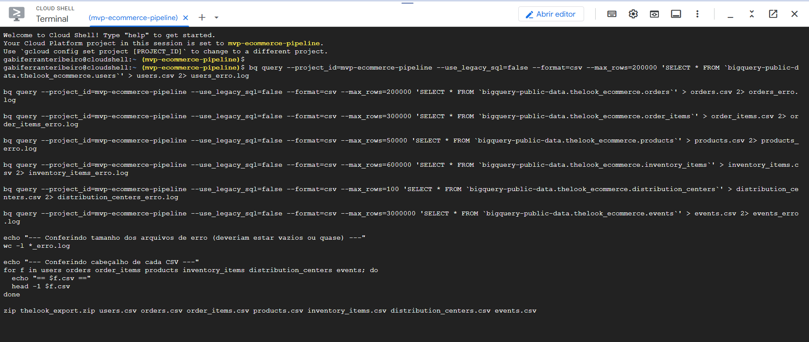

2. **Upload para o Databricks:** os 7 arquivos CSV (extraídos do zip) foram enviados para o Volume `ecommerce_mvp.bronze.raw_files` do Unity Catalog, através do Catalog Explorer (**Upload to this volume**).

Script de extração disponível no GitHub em `scripts/export_all_tables.sh`. Notebook de referência para a ingestão: `notebooks/01_bronze_ingestao.sql` (também documentado no Guia da Pipeline, seção 7).

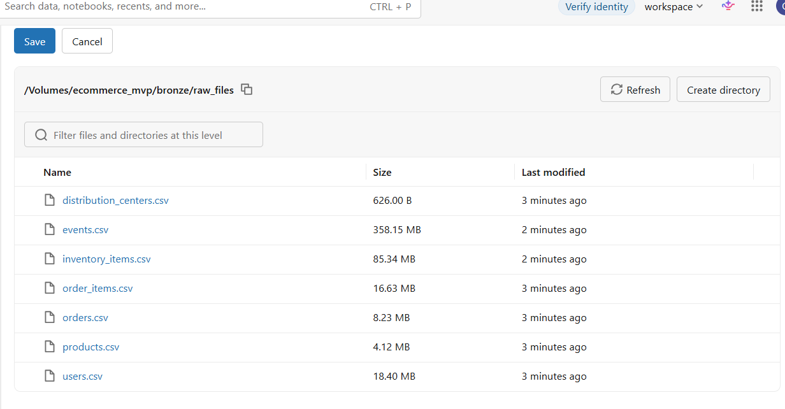

---

## 3. Modelagem e Catálogo de Dados

### Modelo adotado

A modelagem seguiu a **Arquitetura Medalhão** (Bronze → Silver → Gold):
- **Bronze:** cópia fiel das 7 tabelas originais, sem nenhuma transformação, apenas com metadados de controle (`data_ingestao`, `fonte`).
- **Silver:** dados limpos, tipados e renomeados para português, com regras de qualidade aplicadas (Seção 5).
- **Gold:** modelo dimensional simplificado (fato + dimensões), mais tabelas analíticas específicas (`estoque_atual`, `giro_vendas_produto`, `kpis_mensais`, `ciclo_vida_cliente`, `base_crm`, `funil_conversao`) — divididas deliberadamente em várias tabelas menores em vez de uma única tabela consolidada.

### Catálogo de Dados

#### Tabela `silver.clientes`
| Campo | Tipo | Descrição | Domínio observado |
|---|---|---|---|
| id_cliente | int | Identificador único do cliente | — |
| nome / sobrenome | string | Nome e sobrenome | — |
| email | string | E-mail do cliente | — |
| idade | int | Idade do cliente | 12 a 70 anos |
| genero | string | Gênero informado | M, F |
| pais | string | País do cliente | 16 países distintos (destaques: China, Estados Unidos, Brasil) |
| estado / cidade | string | Localização | — |
| data_cadastro | timestamp | Data de cadastro do cliente | 2019-01-19 até o momento da extração |
| origem_trafego | string | Canal de aquisição do cliente | Search, Organic, Facebook, Email, Display |

*Linhagem: derivada de `bronze.users`, que veio do BigQuery (`bigquery-public-data.thelook_ecommerce.users`).*

#### Tabela `silver.produtos`
| Campo | Tipo | Descrição | Domínio observado |
|---|---|---|---|
| id_produto | int | Identificador único do produto | — |
| nome_produto | string | Nome do produto | — |
| categoria | string | Categoria do produto | 26 categorias (ex: Jeans, Tops & Tees, Outerwear & Coats) |
| marca | string | Marca | 2.756 marcas distintas |
| departamento | string | Departamento | Men, Women |
| custo | decimal | Custo do produto | — |
| preco_tabela | decimal | Preço de venda sugerido | $0,02 a $999,00 |
| id_centro_distribuicao | int | Centro de distribuição associado | — |

*Linhagem: derivada de `bronze.products`.*

#### Tabela `silver.pedidos`
| Campo | Tipo | Descrição | Domínio observado |
|---|---|---|---|
| id_pedido | int | Identificador do pedido | — |
| id_cliente | int | Cliente que fez o pedido | — |
| status | string | Status do pedido | Shipped (30,0%), Complete (25,1%), Processing (19,9%), Cancelled (15,0%), Returned (10,0%) |
| data_pedido / data_envio / data_entrega / data_devolucao | timestamp | Datas do ciclo do pedido | 2019-01-19 até o momento da extração |
| qtd_itens | int | Quantidade de itens no pedido | — |

*Linhagem: derivada de `bronze.orders`.*

#### Tabela `silver.itens_pedido`
| Campo | Tipo | Descrição | Domínio observado |
|---|---|---|---|
| id_item | int | Identificador do item do pedido | — |
| id_pedido / id_cliente / id_produto | int | Chaves de relacionamento | — |
| status | string | Status do item | mesmo domínio de `pedidos.status` |
| data_criacao | timestamp | Data da venda | — |
| preco_venda | decimal | Preço efetivamente cobrado | $0,02 a $999,00 |

*Linhagem: derivada de `bronze.order_items`.*

#### Tabela `silver.estoque`
| Campo | Tipo | Descrição | Domínio observado |
|---|---|---|---|
| id_item_estoque | int | Identificador do item de estoque | — |
| id_produto | int | Produto associado | — |
| data_entrada_estoque | timestamp | Quando entrou no estoque | — |
| data_venda | timestamp | Quando foi vendido (nulo se ainda em estoque) | — |
| custo | decimal | Custo do item | — |
| id_centro_distribuicao | int | Centro de distribuição | 10 centros distintos |
| em_estoque_atualmente | boolean | Se ainda está em estoque | true/false |

*Linhagem: derivada de `bronze.inventory_items`.*

#### Tabela `silver.eventos`
| Campo | Tipo | Descrição | Domínio observado |
|---|---|---|---|
| id_evento | int | Identificador único do evento | — |
| id_cliente | int | Cliente que gerou o evento | nulo em ~46,6% dos casos (visitante não autenticado) |
| id_sessao | string | Identificador da sessão de navegação | — |
| sequencia | int | Ordem do evento na sessão | — |
| data_evento | timestamp | Momento do evento | — |
| tipo_evento | string | Estágio do funil | home, department, product, cart, cancel, purchase |
| origem_trafego | string | Canal de origem da sessão | Facebook, Organic, Email, Adwords, YouTube |

*Linhagem: derivada de `bronze.events`.*

#### Tabelas Gold

**`gold.fato_vendas`** (grão: item vendido) — id_item, id_pedido, id_cliente, id_produto, categoria, marca, departamento, preco_venda, custo, margem, data_venda, status_pedido. *Filtra pedidos Cancelled/Returned. Linhagem: `silver.itens_pedido` + `silver.produtos` + `silver.pedidos`.*

**`gold.dim_cliente`** e **`gold.dim_produto`** — cópias das dimensões Silver correspondentes, para uso direto em joins.

**`gold.estoque_atual`** — id_produto, unidades_em_estoque, dias_medios_parado. *Achado real: de 29.044 produtos com estoque, 29.032 (99,96%) têm unidades paradas há mais de 90 dias, com média geral de 1.229 dias (~3,4 anos). Linhagem: `silver.estoque`.*

**`gold.giro_vendas_produto`** — id_produto, categoria, unidades_vendidas_total, unidades_vendidas_90d, receita_total. *Linhagem: `gold.fato_vendas`.*

**`gold.kpis_mensais`** — mes, receita_total, qtd_pedidos, ticket_medio, clientes_ativos, frequencia_media. *Linhagem: `gold.fato_vendas`.*

**`gold.ciclo_vida_cliente`** — mes, id_cliente, classificacao (Novo/Retido/Reativado). *Achado real: 71,2% das observações mensais são "Novo", 22,2% "Reativado" e apenas 6,6% "Retido". Linhagem: `gold.fato_vendas`.*

**`gold.base_crm`** — id_cliente, data_ultima_compra, total_pedidos, receita_total_cliente, dias_desde_ultima_compra, segmento_crm (Acompanhamento padrão / Alvo de reativação / Cliente recorrente de valor). *Linhagem: `gold.fato_vendas`.*

**`gold.funil_conversao`** — id_sessao, id_cliente, origem_trafego, viu_produto, adicionou_carrinho, comprou (flags 0/1 por sessão). *Linhagem: `silver.eventos`.*

**Catálogo, schemas e tabelas:**

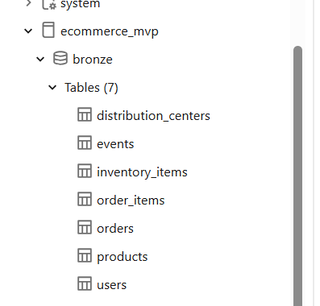


## 4. Pipeline de Dados

A pipeline foi **ramificada em 6 notebooks**, um por responsabilidade, em vez de um único notebook monolítico — isso facilita depuração isolada de cada etapa e deixa o histórico de commits no Git mais claro:

| Notebook | Responsabilidade |
|---|---|
| `00_setup` | Criação do catálogo, schemas e volume no Unity Catalog |
| `01_bronze_ingestao` | Ingestão bruta das 7 tabelas a partir dos CSVs no Volume |
| `02_qualidade_dados` | Consultas de diagnóstico de qualidade (completude, consistência, unicidade, outliers) |
| `03_silver_transformacao` | Limpeza, tipagem, renomeação e regras de negócio |
| `04_gold_modelagem` | Modelo dimensional + tabelas analíticas (KPIs, estoque, ciclo de vida, funil) |
| `05_analise_final` | Consultas que respondem cada uma das 18 perguntas de negócio |

A camada Gold foi deliberadamente dividida em várias tabelas menores e independentes (em vez de uma única tabela pré-agregada com tudo cruzado) para viabilizar um **Databricks Dashboard** que cruza essas tabelas visualmente (ex: `estoque_atual` + `giro_vendas_produto` para a análise de cobertura de estoque) — aproximando o resultado final de como um time de dados real disponibilizaria essas métricas para consumo por outras áreas.

Scripts disponíveis no GitHub em `notebooks/` (referenciar o link do seu repositório aqui).

### 4.1 Setup — catálogo, schemas e volume (`00_setup`)

```sql
CREATE CATALOG IF NOT EXISTS ecommerce_mvp;
CREATE SCHEMA IF NOT EXISTS ecommerce_mvp.bronze;
CREATE SCHEMA IF NOT EXISTS ecommerce_mvp.silver;
CREATE SCHEMA IF NOT EXISTS ecommerce_mvp.gold;
CREATE VOLUME IF NOT EXISTS ecommerce_mvp.bronze.raw_files;
```

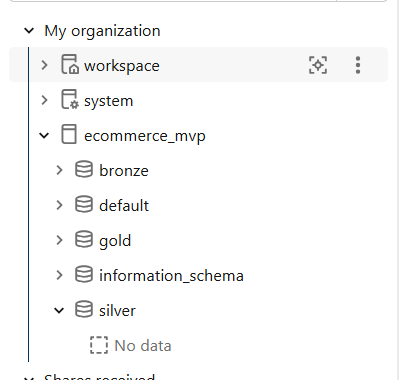

### 4.2 Camada Bronze — ingestão do dado bruto (`01_bronze_ingestao`)

Nenhuma limpeza é feita aqui — cada tabela entra exatamente como veio do CSV, só com metadados de controle (`data_ingestao`, `fonte`):

```sql
CREATE OR REPLACE TABLE ecommerce_mvp.bronze.users AS
SELECT *, current_timestamp() AS data_ingestao, 'BigQuery - TheLook eCommerce' AS fonte
FROM read_files('/Volumes/ecommerce_mvp/bronze/raw_files/users.csv', format => 'csv', header => true, inferSchema => true);

CREATE OR REPLACE TABLE ecommerce_mvp.bronze.orders AS
SELECT *, current_timestamp() AS data_ingestao, 'BigQuery - TheLook eCommerce' AS fonte
FROM read_files('/Volumes/ecommerce_mvp/bronze/raw_files/orders.csv', format => 'csv', header => true, inferSchema => true);

CREATE OR REPLACE TABLE ecommerce_mvp.bronze.order_items AS
SELECT *, current_timestamp() AS data_ingestao, 'BigQuery - TheLook eCommerce' AS fonte
FROM read_files('/Volumes/ecommerce_mvp/bronze/raw_files/order_items.csv', format => 'csv', header => true, inferSchema => true);

CREATE OR REPLACE TABLE ecommerce_mvp.bronze.products AS
SELECT *, current_timestamp() AS data_ingestao, 'BigQuery - TheLook eCommerce' AS fonte
FROM read_files('/Volumes/ecommerce_mvp/bronze/raw_files/products.csv', format => 'csv', header => true, inferSchema => true);

CREATE OR REPLACE TABLE ecommerce_mvp.bronze.inventory_items AS
SELECT *, current_timestamp() AS data_ingestao, 'BigQuery - TheLook eCommerce' AS fonte
FROM read_files('/Volumes/ecommerce_mvp/bronze/raw_files/inventory_items.csv', format => 'csv', header => true, inferSchema => true);

CREATE OR REPLACE TABLE ecommerce_mvp.bronze.distribution_centers AS
SELECT *, current_timestamp() AS data_ingestao, 'BigQuery - TheLook eCommerce' AS fonte
FROM read_files('/Volumes/ecommerce_mvp/bronze/raw_files/distribution_centers.csv', format => 'csv', header => true, inferSchema => true);

CREATE OR REPLACE TABLE ecommerce_mvp.bronze.events AS
SELECT *, current_timestamp() AS data_ingestao, 'BigQuery - TheLook eCommerce' AS fonte
FROM read_files('/Volumes/ecommerce_mvp/bronze/raw_files/events.csv', format => 'csv', header => true, inferSchema => true);

```
**Resultados**

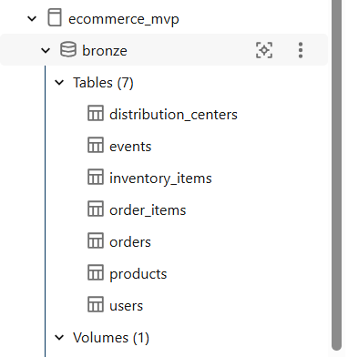

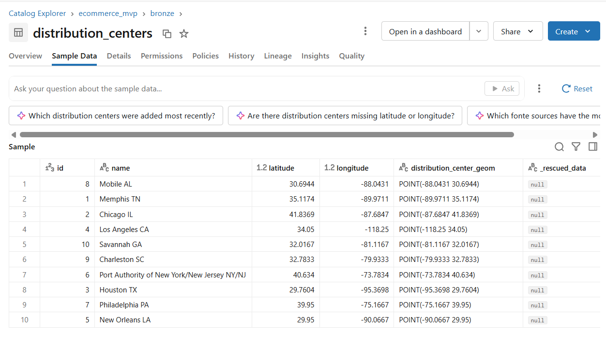

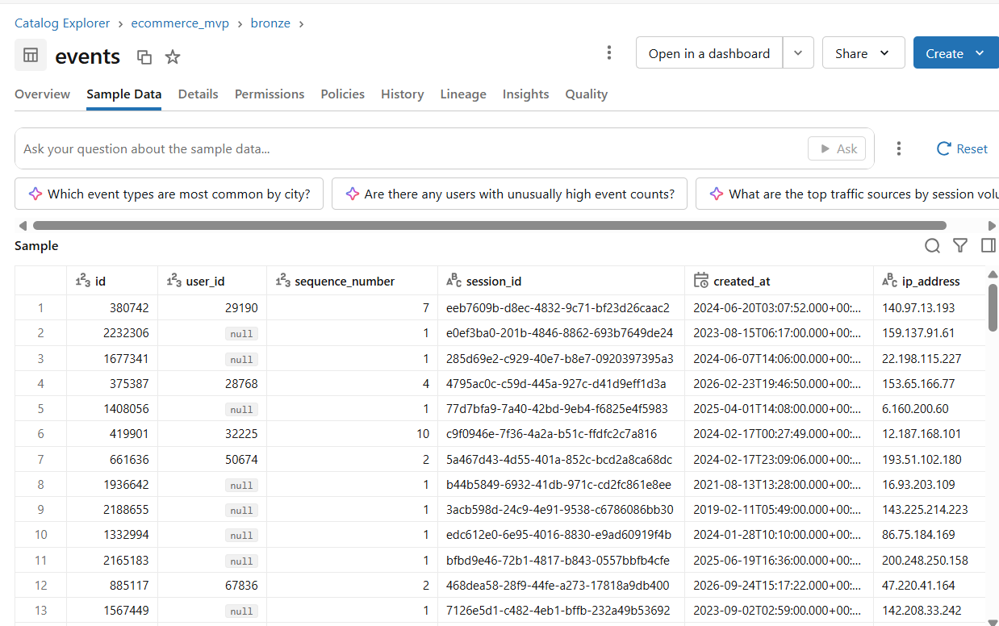

**O que foi feito:** ingestão bruta das 7 tabelas a partir dos CSVs no Volume, sem nenhuma limpeza, apenas adicionando duas colunas de controle (`data_ingestao`, `fonte`).
**Por que foi feito:** preservar o dado exatamente como veio da origem (BigQuery), garantindo rastreabilidade — se algo der errado nas camadas seguintes, sempre dá para voltar ao dado bruto e conferir o que realmente chegou.
**Impacto nos dados:** nenhum impacto no conteúdo; adiciona apenas metadados de auditoria (quando e de onde o dado veio).

### 4.3 Camada Silver — limpeza e padronização (`03_silver_transformacao`)

Regras aplicadas: remoção de registros sem chave primária/estrangeira essencial, tipagem correta de datas e valores decimais, renomeação de colunas para português, e filtro de preços inválidos:

```sql
CREATE OR REPLACE TABLE ecommerce_mvp.silver.clientes AS
SELECT id AS id_cliente, first_name AS nome, last_name AS sobrenome, email, age AS idade,
       gender AS genero, country AS pais, state AS estado, city AS cidade,
       CAST(created_at AS DATE) AS data_cadastro, traffic_source AS origem_trafego
FROM ecommerce_mvp.bronze.users
WHERE id IS NOT NULL
ORDER BY data_cadastro;
```
- **O que foi feito:** renomeação de colunas para português, conversão de `created_at` de timestamp para `DATE` (removendo a hora, desnecessária para as análises), filtro removendo registros com `id` nulo.
- **Por que foi feito:** um cliente sem `id` não pode ser relacionado a nenhum pedido — mantê-lo geraria linhas inúteis para qualquer análise de negócio.
- **Impacto nos dados:** nenhuma linha foi de fato removida (checagem de qualidade mostrou 0 valores nulos em `id`); o filtro funciona como trava de segurança, não como limpeza efetiva.

```sql
CREATE OR REPLACE TABLE ecommerce_mvp.silver.produtos AS
SELECT id AS id_produto, TRIM(name) AS nome_produto, TRIM(category) AS categoria,
       TRIM(brand) AS marca, TRIM(department) AS departamento,
       CAST(cost AS DECIMAL(10,2)) AS custo, CAST(retail_price AS DECIMAL(10,2)) AS preco_tabela,
       distribution_center_id AS id_centro_distribuicao
FROM ecommerce_mvp.bronze.products
WHERE id IS NOT NULL AND retail_price > 0
ORDER BY id_produto;
```

- **O que foi feito:** renomeação de colunas, `TRIM()` em campos de texto (`category`, `brand`, `department`), conversão de `cost` e `retail_price` para `DECIMAL(10,2)`, filtro removendo produtos com `id` nulo ou `retail_price <= 0`.
- **Por que foi feito:** o `TRIM()` evita que espaços em branco acidentais (ex: `"Jeans "` vs. `"Jeans"`) façam o mesmo valor ser contado como duas categorias diferentes num `GROUP BY`. O filtro de preço remove produtos que não fariam sentido em análise de receita.
- **Impacto nos dados:** a checagem de qualidade não encontrou preços inválidos, então nenhuma linha foi removida na prática — o filtro protege execuções futuras com dados novos.

```sql
CREATE OR REPLACE TABLE ecommerce_mvp.silver.pedidos AS
SELECT order_id AS id_pedido, user_id AS id_cliente, status,
       CAST(created_at AS DATE) AS data_pedido, CAST(shipped_at AS DATE) AS data_envio,
       CAST(delivered_at AS DATE) AS data_entrega, CAST(returned_at AS DATE) AS data_devolucao,
       num_of_item AS qtd_itens
FROM ecommerce_mvp.bronze.orders
WHERE order_id IS NOT NULL AND user_id IS NOT NULL
ORDER BY data_pedido;
```

- **O que foi feito:** renomeação de colunas, conversão das 4 colunas de data (`created_at`, `shipped_at`, `delivered_at`, `returned_at`) de timestamp para `DATE`, filtro removendo pedidos com `order_id` ou `user_id` nulos.
- **Por que foi feito:** um pedido sem `user_id` não pode ser associado a nenhum cliente, o que inviabilizaria a análise de CRM e ciclo de vida (bloco D). Converter para `DATE` simplifica os cálculos de prazo de entrega (`DATEDIFF`) sem perder precisão relevante para o negócio.
- **Impacto nos dados:** 0 registros removidos (sem nulos encontrados); o impacto real é a padronização do tipo de data, que passou a permitir contas de tempo sem conversões extras.

```sql
CREATE OR REPLACE TABLE ecommerce_mvp.silver.itens_pedido AS
SELECT id AS id_item, order_id AS id_pedido, user_id AS id_cliente, product_id AS id_produto, status,
       CAST(created_at AS DATE) AS data_criacao, CAST(sale_price AS DECIMAL(10,2)) AS preco_venda
FROM ecommerce_mvp.bronze.order_items
WHERE sale_price > 0
ORDER BY data_criacao;
```

- **O que foi feito:** renomeação de colunas, conversão de `sale_price` para `DECIMAL(10,2)`, conversão de `created_at` para `DATE`, filtro removendo itens com `sale_price <= 0`.
- **Por que foi feito:** um item vendido por preço zero ou negativo distorceria diretamente o cálculo de receita e ticket médio.
- **Impacto nos dados:** nenhum valor inválido encontrado nesta execução; o filtro segue como proteção para cargas futuras.

```sql
CREATE OR REPLACE TABLE ecommerce_mvp.silver.estoque AS
SELECT id AS id_item_estoque, product_id AS id_produto,
       CAST(created_at AS DATE) AS data_entrada_estoque, CAST(sold_at AS DATE) AS data_venda,
       CAST(cost AS DECIMAL(10,2)) AS custo, product_distribution_center_id AS id_centro_distribuicao,
       CASE WHEN sold_at IS NULL THEN true ELSE false END AS em_estoque_atualmente
FROM ecommerce_mvp.bronze.inventory_items
ORDER BY data_entrada_estoque;
```

- **O que foi feito:** renomeação de colunas, conversão de `created_at` e `sold_at` para `DATE`, criação da coluna calculada `em_estoque_atualmente` (`true` quando `sold_at` é nulo).
- **Por que foi feito:** a tabela bruta só informa a data de venda (nula se ainda não vendido) — a flag booleana explícita simplifica todas as consultas de cobertura de estoque, evitando repetir `WHERE sold_at IS NULL` em cada consulta.
- **Impacto nos dados:** nenhuma linha removida; o impacto é a adição de uma coluna derivada usada como padrão no restante do pipeline.

```sql
CREATE OR REPLACE TABLE ecommerce_mvp.silver.centros_distribuicao AS
SELECT id AS id_centro_distribuicao, name AS nome, latitude, longitude
FROM ecommerce_mvp.bronze.distribution_centers
ORDER BY id_centro_distribuicao;
```

- **O que foi feito:** renomeação de colunas (`name` → `nome`), sem filtros adicionais.
- **Por que foi feito:** tabela pequena (10 linhas) e já limpa — só precisava padronizar o idioma das colunas.
- **Impacto nos dados:** nenhum impacto no conteúdo, só nos nomes das colunas.

```sql
CREATE OR REPLACE TABLE ecommerce_mvp.silver.eventos AS
SELECT
    id AS id_evento,
    user_id AS id_cliente,
    session_id AS id_sessao,
    sequence_number AS sequencia,
    CAST(created_at AS DATE) AS data_evento,
    event_type AS tipo_evento,
    traffic_source AS origem_trafego
FROM ecommerce_mvp.bronze.events
WHERE session_id IS NOT NULL
ORDER BY data_evento;
```

- **O que foi feito:** renomeação de colunas, conversão de `created_at` para `DATE`, filtro removendo eventos com `session_id` nulo.
- **Por que foi feito:** sem `session_id`, não é possível agrupar os eventos de uma mesma sessão para montar o funil de conversão.
- **Impacto nos dados:** 0 linhas removidas (sem nulos em `session_id`). **Decisão explícita de não tratar:** `id_cliente` continua nulo em ~46,6% das linhas — mantido de propósito, pois representa visitantes não autenticados; removê-los destruiria a possibilidade de medir o funil completo.


**Exemplos de Resultados**

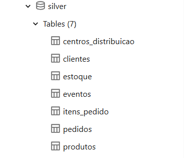

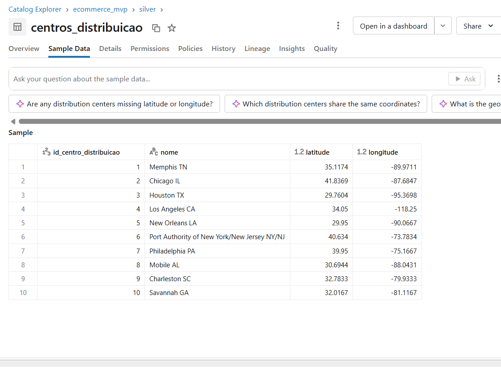

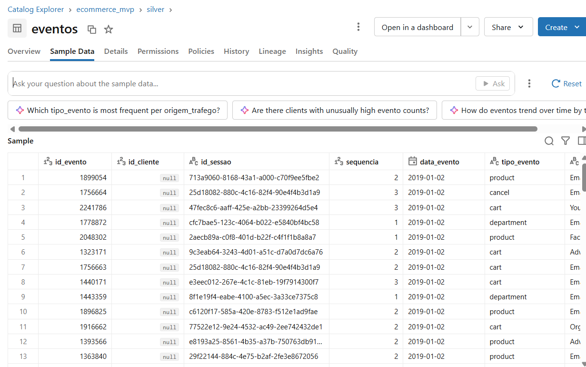


### 4.4 Camada Gold — modelo dimensional e tabelas para gráficos (`04_gold_modelagem`)

A Gold não entrega tudo pré-cruzado numa única tabela: dimensões, fato de vendas e tabelas analíticas ficam separadas para permitir montar visualizações e cruzamentos flexíveis num Databricks Dashboard.


```sql
CREATE OR REPLACE TABLE ecommerce_mvp.gold.dim_cliente AS SELECT * FROM ecommerce_mvp.silver.clientes;
```

```sql
CREATE OR REPLACE TABLE ecommerce_mvp.gold.dim_produto AS SELECT * FROM ecommerce_mvp.silver.produtos;
```

- **O que foi feito:** cópia direta de `silver.clientes` e `silver.produtos`, sem transformação adicional.
- **Por que foi feito:** disponibilizar as dimensões prontas para uso em `JOIN`s repetidos nas demais tabelas Gold.
- **Impacto nos dados:** nenhum — cópia 1:1.


```sql
CREATE OR REPLACE TABLE ecommerce_mvp.gold.fato_vendas AS
SELECT ip.id_item, ip.id_pedido, ip.id_cliente, ip.id_produto,
       p.categoria, p.marca, p.departamento,
       ip.preco_venda, p.custo, (ip.preco_venda - p.custo) AS margem,
       ip.data_criacao AS data_venda, ped.status AS status_pedido
FROM ecommerce_mvp.silver.itens_pedido ip
JOIN ecommerce_mvp.silver.produtos p ON ip.id_produto = p.id_produto
JOIN ecommerce_mvp.silver.pedidos ped ON ip.id_pedido = ped.id_pedido
WHERE ped.status NOT IN ('Cancelled', 'Returned');
```

- **O que foi feito:** `JOIN` entre `silver.itens_pedido`, `silver.produtos` e `silver.pedidos` pelas chaves `id_produto` e `id_pedido`, criação da coluna calculada `margem` (`preco_venda - custo`), filtro excluindo pedidos com `status` igual a `Cancelled` ou `Returned`.
- **Por que foi feito:** o `JOIN` enriquece cada item vendido com categoria/marca/departamento do produto e status do pedido, viabilizando as análises de mix e margem sem navegar por 3 tabelas a cada consulta. O filtro de status existe porque um pedido cancelado/devolvido não representa receita real.
- **Impacto nos dados:** maior impacto quantitativo do pipeline — **25,0% das linhas de `itens_pedido` são excluídas** (correspondente à taxa de cancelamento/devolução medida na Pergunta 3), já que `fato_vendas` é a base de todas as métricas de receita e KPIs.

```sql
CREATE OR REPLACE TABLE ecommerce_mvp.gold.estoque_atual AS
SELECT id_produto, count(*) AS unidades_em_estoque,
       AVG(DATEDIFF(current_date(), data_entrada_estoque)) AS dias_medios_parado
FROM ecommerce_mvp.silver.estoque
WHERE em_estoque_atualmente = true
GROUP BY id_produto;
```

- **O que foi feito:** agregação de `silver.estoque` por `id_produto`, contando unidades com `em_estoque_atualmente = true` e calculando a média de dias parados.
- **Por que foi feito:** transformar registros individuais de estoque numa visão por produto, granularidade necessária para responder cobertura de estoque e tempo parado.
- **Impacto nos dados:** reduz de ~490 mil itens individuais para ~29 mil produtos únicos, trocando granularidade de item por produto.


```sql
CREATE OR REPLACE TABLE ecommerce_mvp.gold.giro_vendas_produto AS
SELECT id_produto, categoria, COUNT(*) AS unidades_vendidas_total,
       COUNT(CASE WHEN data_venda >= date_sub(current_date(), 90) THEN 1 END) AS unidades_vendidas_90d,
       SUM(preco_venda) AS receita_total
FROM ecommerce_mvp.gold.fato_vendas
GROUP BY id_produto, categoria;
```

- **O que foi feito:** agregação de `gold.fato_vendas` por `id_produto`, calculando unidades vendidas totais, unidades vendidas nos últimos 90 dias e receita total.
- **Por que foi feito:** separar "vendas totais" de "vendas recentes" é o que permite calcular o índice de giro, comparando estoque atual com demanda recente (mais acionável que demanda histórica acumulada).
- **Impacto nos dados:** agregação por produto; sem perda de informação relevante para o objetivo.

```sql
CREATE OR REPLACE TABLE ecommerce_mvp.gold.kpis_mensais AS
SELECT DATE_TRUNC('month', data_venda) AS mes,
       CAST(ROUND(SUM(preco_venda),2) AS DECIMAL(10,2)) AS receita_total,
       COUNT(DISTINCT id_pedido) AS qtd_pedidos,
       CAST(ROUND(SUM(preco_venda) / COUNT(DISTINCT id_pedido),2) AS DECIMAL(10,2)) AS ticket_medio,
       COUNT(DISTINCT id_cliente) AS clientes_ativos,
       ROUND(COUNT(DISTINCT id_pedido) / COUNT(DISTINCT id_cliente),2) AS frequencia_media
FROM ecommerce_mvp.gold.fato_vendas
GROUP BY DATE_TRUNC('month', data_venda);
```

- **O que foi feito:** agregação de `gold.fato_vendas` por mês, com receita, pedidos, ticket médio, clientes ativos e frequência média, arredondados para 2 casas decimais.
- **Por que foi feito:** consolidar as métricas centrais de desempenho comercial numa única tabela pronta para consumo direto no dashboard.
- **Impacto nos dados:** reduz de ~93 mil pedidos para uma linha por mês (~92 meses no período total) — tabela de resumo, não de detalhe.

```sql
CREATE OR REPLACE TABLE ecommerce_mvp.gold.ciclo_vida_cliente AS
WITH compras_mensais AS (
    SELECT id_cliente, DATE_TRUNC('month', data_venda) AS mes
    FROM ecommerce_mvp.gold.fato_vendas
    GROUP BY id_cliente, DATE_TRUNC('month', data_venda)
),
com_mes_anterior AS (
    SELECT *, LAG(mes) OVER (PARTITION BY id_cliente ORDER BY mes) AS mes_anterior
    FROM compras_mensais
)
SELECT mes, id_cliente,
    CASE WHEN mes_anterior IS NULL THEN 'Novo'
         WHEN MONTHS_BETWEEN(mes, mes_anterior) <= 2 THEN 'Retido'
         ELSE 'Reativado' END AS classificacao
FROM com_mes_anterior;
```

- **O que foi feito:** para cada cliente, cálculo do mês de cada compra e comparação com o mês da compra anterior (`LAG`), classificando cada observação mensal como "Novo", "Retido" ou "Reativado".
- **Por que foi feito:** transformação que diretamente responde à pergunta de ciclo de vida/churn — sem ela, só teríamos a data de cada compra, não uma classificação do comportamento do cliente.
- **Impacto nos dados:** cria uma linha por combinação cliente-mês (não por cliente único); um cliente que comprou em 5 meses diferentes aparece 5 vezes, cada vez com classificação potencialmente diferente.

```sql
CREATE OR REPLACE TABLE ecommerce_mvp.gold.base_crm AS
WITH ultima_compra AS (
    SELECT id_cliente, MAX(data_venda) AS data_ultima_compra,
           COUNT(DISTINCT id_pedido) AS total_pedidos, SUM(preco_venda) AS receita_total_cliente
    FROM ecommerce_mvp.gold.fato_vendas
    GROUP BY id_cliente
)
SELECT id_cliente,
    date_format(data_ultima_compra, 'dd/MM/yyyy') AS data_ultima_compra,
    total_pedidos,
    CAST(ROUND(receita_total_cliente,2) AS DECIMAL(10,2)) AS receita_total_cliente,
    DATEDIFF(current_date(), data_ultima_compra) AS dias_desde_ultima_compra,
    CASE WHEN DATEDIFF(current_date(), data_ultima_compra) > 180 AND total_pedidos > 1 THEN 'Alvo de reativação'
         WHEN total_pedidos >= 3 THEN 'Cliente recorrente de valor'
         ELSE 'Acompanhamento padrão' END AS segmento_crm
FROM ultima_compra;
```

- **O que foi feito:** agregação por cliente da data da última compra, total de pedidos e receita histórica, com classificação de segmento (`Alvo de reativação`, `Cliente recorrente de valor`, `Acompanhamento padrão`) baseada em dias desde a última compra e quantidade de pedidos.
- **Por que foi feito:** transformar dados transacionais brutos numa lista acionável para campanhas de CRM — um time de marketing consulta uma lista já segmentada, não uma tabela de vendas.
- **Impacto nos dados:** reduz para uma linha por cliente; a regra de classificação (180 dias e 1+ pedido para "Alvo de reativação") é uma decisão de negócio documentada aqui para auditoria/ajuste futuro.

```sql
CREATE OR REPLACE TABLE ecommerce_mvp.gold.funil_conversao AS
SELECT
    id_sessao,
    MAX(id_cliente) AS id_cliente,
    MAX(origem_trafego) AS origem_trafego,
    MAX(CASE WHEN tipo_evento IN ('home', 'department') THEN 1 ELSE 0 END) AS viu_home,
    MAX(CASE WHEN tipo_evento = 'product' THEN 1 ELSE 0 END) AS viu_produto,
    MAX(CASE WHEN tipo_evento = 'cart' THEN 1 ELSE 0 END) AS adicionou_carrinho,
    MAX(CASE WHEN tipo_evento = 'purchase' THEN 1 ELSE 0 END) AS comprou
FROM ecommerce_mvp.silver.eventos
GROUP BY id_sessao;
```

- **O que foi feito:** agregação de `silver.eventos` por `session_id`, transformando a sequência de eventos em flags binárias (0/1) indicando se a sessão chegou a visualizar produto, adicionar ao carrinho e comprar.
- **Por que foi feito:** o dado bruto é uma linha por ação individual — medir conversão exige antes resumir cada sessão numa única linha que diga "até onde ela chegou".
- **Impacto nos dados:** reduz de ~2,4 milhões de eventos para ~680 mil sessões únicas; sessões sem `id_cliente` são mantidas, permitindo medir conversão de visitantes anônimos junto com clientes identificados.


**Exemplos Tabelas camada Gold**

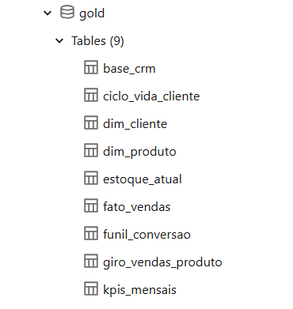

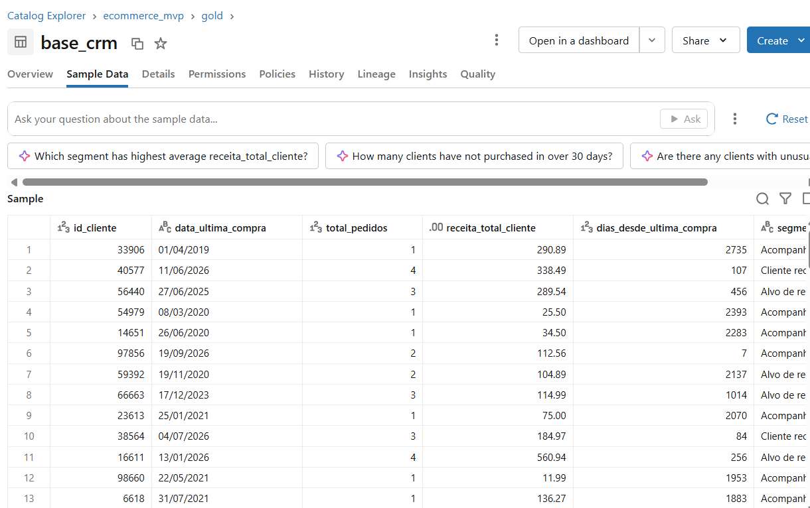

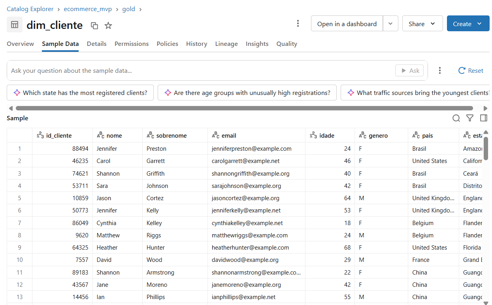


## 5. Qualidade de Dados

Por ser um dataset sintético gerado programaticamente, o TheLook eCommerce chega **extremamente limpo** — a maior parte das checagens não encontrou problemas. Isso não invalida a etapa: a verificação foi feita e documentada como evidência de que os dados estão prontos para análise.

### Consultas de diagnóstico (`02_qualidade_dados`)

```sql
-- Completude
SELECT count(*) AS total,
       count(*) - count(user_id) AS nulos_user,
       count(*) - count(product_id) AS nulos_produto,
       count(*) - count(sale_price) AS nulos_preco
FROM ecommerce_mvp.bronze.order_items;

-- Consistência: valores negativos ou zerados
SELECT count(*) AS precos_invalidos
FROM ecommerce_mvp.bronze.order_items
WHERE sale_price <= 0;

-- Unicidade: duplicidade de id de item de pedido
SELECT id, count(*) AS repeticoes
FROM ecommerce_mvp.bronze.order_items
GROUP BY id HAVING count(*) > 1;

-- Acurácia/Outliers: preços muito acima do normal
SELECT * FROM ecommerce_mvp.bronze.order_items ORDER BY sale_price DESC LIMIT 20;

-- Consistência de status (pedidos cancelados/retornados)
SELECT status, count(*) FROM ecommerce_mvp.bronze.orders GROUP BY status;

-- Completude de users e products
SELECT count(*) - count(id) AS nulos_id FROM ecommerce_mvp.bronze.users;
SELECT count(*) AS produtos_custo_maior_preco FROM ecommerce_mvp.bronze.products WHERE cost > retail_price;

-- Completude de events (visitantes não identificados)
SELECT count(*) AS total, count(*) - count(session_id) AS nulos_sessao, count(*) - count(user_id) AS nulos_usuario
FROM ecommerce_mvp.bronze.events;
```

### Achados e tratamentos aplicados

| Atributo verificado | Resultado da checagem | Tratamento aplicado |
|---|---|---|
| `order_items.user_id` / `product_id` | 0 valores nulos | Nenhum tratamento necessário |
| `order_items.sale_price` | 0 valores nulos ou ≤ 0 | Filtro defensivo `sale_price > 0` mantido na Silver por segurança |
| `order_items.id` (unicidade) | 0 registros duplicados | Nenhum tratamento necessário |
| `users.id` (unicidade) | 0 registros duplicados | Nenhum tratamento necessário |
| `users.age` | 0 valores fora do intervalo 0–100 (min 12, max 70) | Nenhum tratamento necessário |
| `products.cost` vs `retail_price` | 0 produtos com custo maior que o preço de venda (o que indicaria erro de cadastro) | Nenhum tratamento necessário |
| `orders.status` (consistência) | 5 valores distintos e coerentes: Shipped, Complete, Processing, Cancelled, Returned — juntos, Cancelled + Returned somam 25,0% dos pedidos | Pedidos com status Cancelled/Returned foram **excluídos** de `gold.fato_vendas` para não distorcer receita e KPIs |
| Taxa de cancelamento/devolução por categoria | Distribuição uniforme entre categorias, entre 25% e 31% — sem categoria clara como outlier (a maior, "Clothing Sets", tem apenas 191 itens, amostra pequena) | Nenhum tratamento adicional; documentado como achado |
| `events.session_id` | 0 valores nulos | Nenhum tratamento necessário |
| `events.user_id` | ~46,6% nulos (1.124.968 de 2.415.005 eventos) | **Esperado** — representa visitantes não autenticados navegando no site; mantido como está na Silver, pois é informação válida para o funil (só não permite ligar a sessão a um cliente específico) |

**Exemplos de Resultados:**

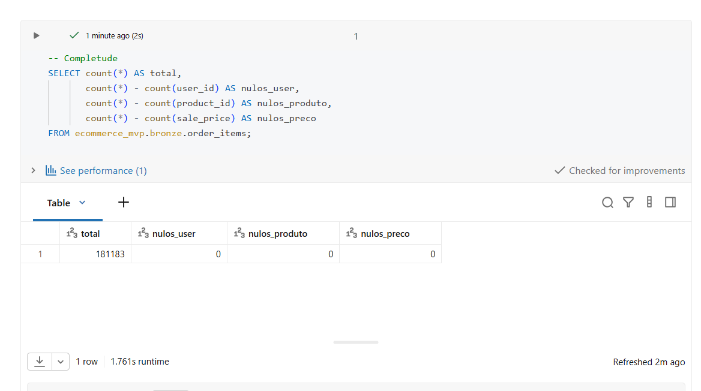

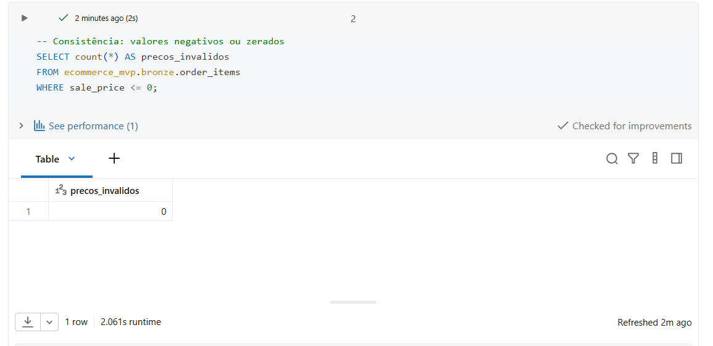

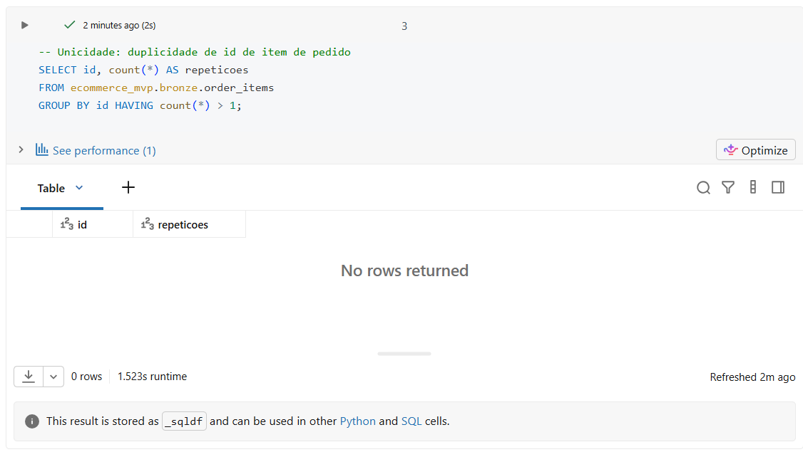

---

## 6. Análise de Dados

### A. Desempenho comercial e KPIs gerais

**Pergunta 1 — KPIs gerais**
```sql
SELECT
  COUNT(*) AS total_itens_vendidos,
  CAST(ROUND(SUM(preco_venda),2) AS DECIMAL(10,2)) AS receita_total,
  COUNT(DISTINCT id_pedido) AS total_pedidos,
  CAST(ROUND(SUM(preco_venda)/COUNT(DISTINCT id_pedido),2) AS DECIMAL(10,2)) AS ticket_medio_geral,
  COUNT(DISTINCT id_cliente) AS clientes_unicos,
  ROUND(COUNT(DISTINCT id_pedido)/COUNT(DISTINCT id_cliente),2) AS pedidos_por_cliente
FROM ecommerce_mvp.gold.fato_vendas;

SELECT date_format(t.mes, 'MM/yyyy') AS mes, receita_total, qtd_pedidos, ticket_medio, clientes_ativos, frequencia_media
FROM ecommerce_mvp.gold.kpis_mensais t
ORDER BY t.mes;
```
Considerando apenas pedidos não cancelados/devolvidos, a loja acumula **136.178 itens vendidos**, gerando **US$ 8.088.564,35** em receita, distribuídos em **93.547 pedidos** de **66.048 clientes únicos**. O ticket médio geral é de **US$ 86,47** e cada cliente faz, em média, **1,42 pedidos**. O volume mensal mais recente mostra forte aceleração: setembro/2026 (mês parcial) já supera agosto/2026 inteiro (US$ 618 mil vs. US$ 359 mil), com crescimento mês a mês consistente ao longo de 2026 (de US$ 188 mil em fevereiro para os valores atuais). *A receita está em trajetória de crescimento acelerado nos meses mais recentes — vale investigar se isso reflete sazonalidade, uma campanha específica ou crescimento orgânico sustentado, para decidir se o ritmo de investimento em estoque e operação deve acompanhar esse ritmo.*

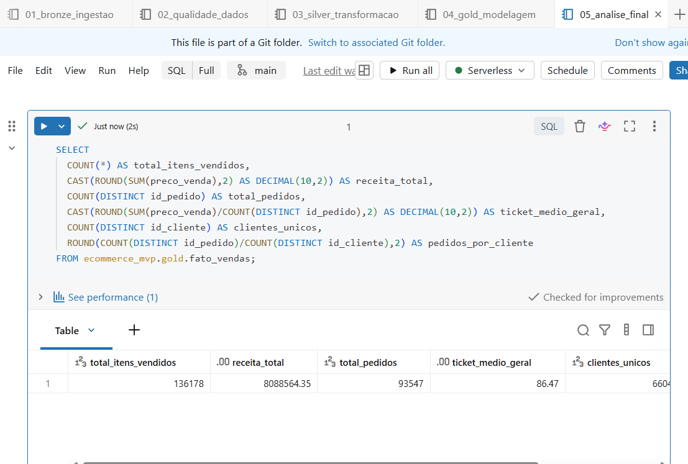

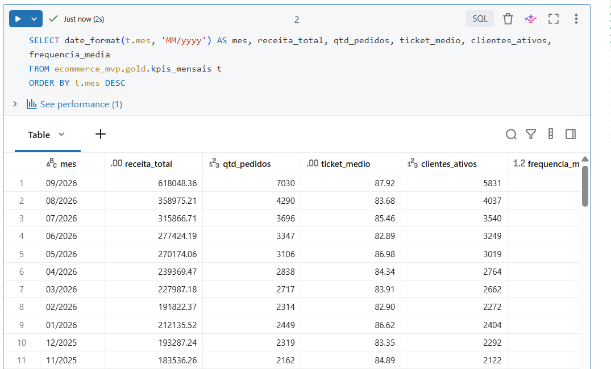

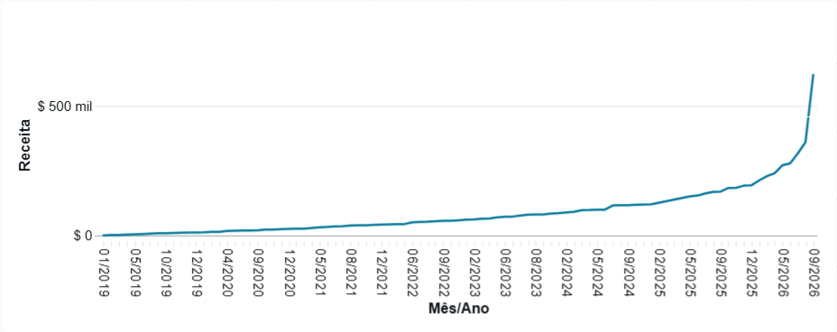

**Pergunta 2 — Sazonalidade (mês e dia da semana)**
```sql
-- Por dia da semana
SELECT date_format(data_venda, 'EEEE') AS dia_semana,
       CAST(ROUND(SUM(preco_venda),2) AS DECIMAL(10,2)) AS receita,
       COUNT(DISTINCT id_pedido) AS pedidos
FROM ecommerce_mvp.gold.fato_vendas
GROUP BY date_format(data_venda, 'EEEE')
ORDER BY receita DESC;

-- Tendência mensal (últimos 15 meses)
SELECT date_format(t.mes, 'MM/yyyy') AS mes, receita_total, qtd_pedidos, ticket_medio, clientes_ativos, frequencia_media
FROM ecommerce_mvp.gold.kpis_mensais t
ORDER BY t.mes DESC LIMIT 15;
```
A receita por dia da semana é bastante uniforme com sexta-feira tendo o maior volume de vendas. Já a sazonalidade mensal mostra crescimento consistente mês a mês em 2026. *Não há um "dia mais forte" para concentrar campanhas; o padrão relevante é o crescimento mensal, não semanal.*

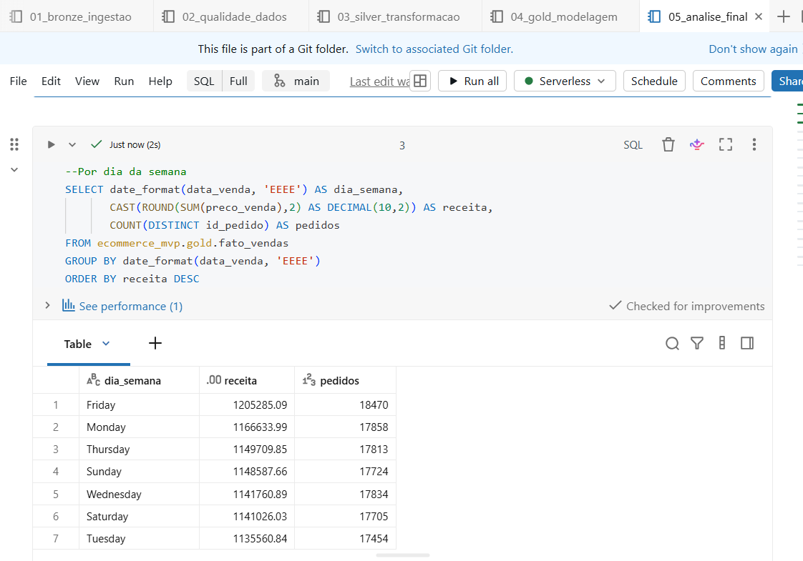

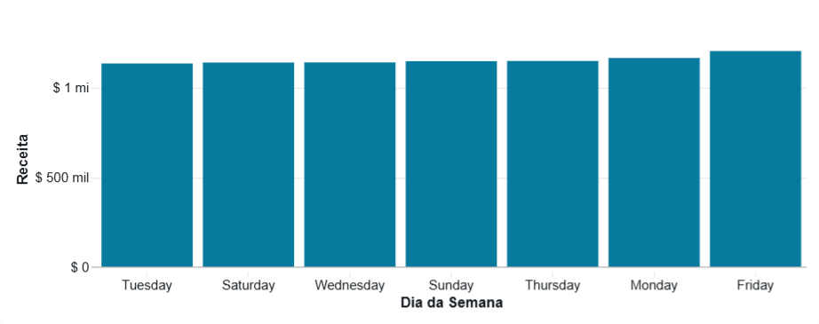

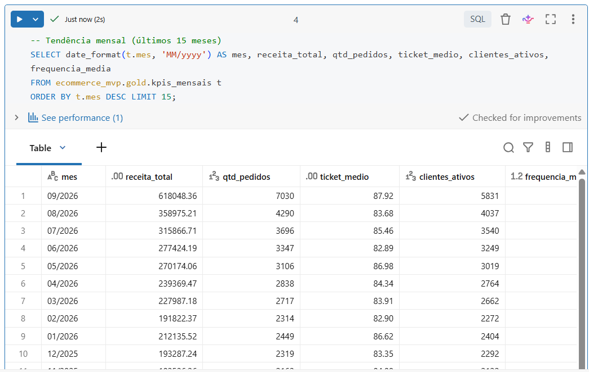


**Pergunta 3 — Cancelamento e devolução**
```sql
-- Taxa geral
SELECT status, COUNT(*) AS qtd,
       ROUND(COUNT(*)*100.0/SUM(COUNT(*)) OVER(),1) AS pct
FROM ecommerce_mvp.silver.pedidos
GROUP BY status ORDER BY qtd DESC;

-- Por categoria de produto
SELECT p.categoria,
       COUNT(*) AS total_itens,
       SUM(CASE WHEN ped.status IN ('Cancelled','Returned') THEN 1 ELSE 0 END) AS cancel_devol,
       ROUND(SUM(CASE WHEN ped.status IN ('Cancelled','Returned') THEN 1 ELSE 0 END)*100.0/COUNT(*),1) AS pct_cancel_devol
FROM ecommerce_mvp.silver.itens_pedido ip
JOIN ecommerce_mvp.silver.produtos p ON ip.id_produto = p.id_produto
JOIN ecommerce_mvp.silver.pedidos ped ON ip.id_pedido = ped.id_pedido
GROUP BY p.categoria
ORDER BY pct_cancel_devol DESC;
```
Juntos, pedidos "Cancelled" (15%) e "Returned" (10%) somam **25%** de todos os pedidos. Ao quebrar por categoria de produto, a taxa se mantém entre 25% e 26% de forma bastante homogênea — não há uma categoria clara concentrando o problema. *O cancelamento/devolução é um problema estrutural e geral do negócio (1 em cada 4 pedidos), não um problema pontual de categoria — a ação corretiva provavelmente deve mirar o processo de checkout/pagamento, política de devolução como um todo ou avaliação de qualidade como um todo, não um produto específico.*

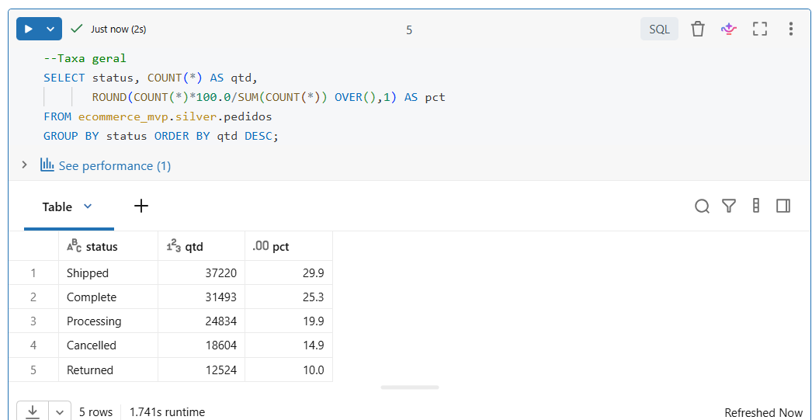

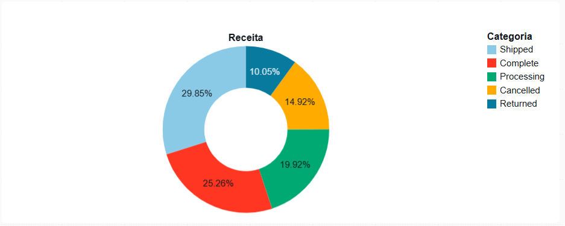

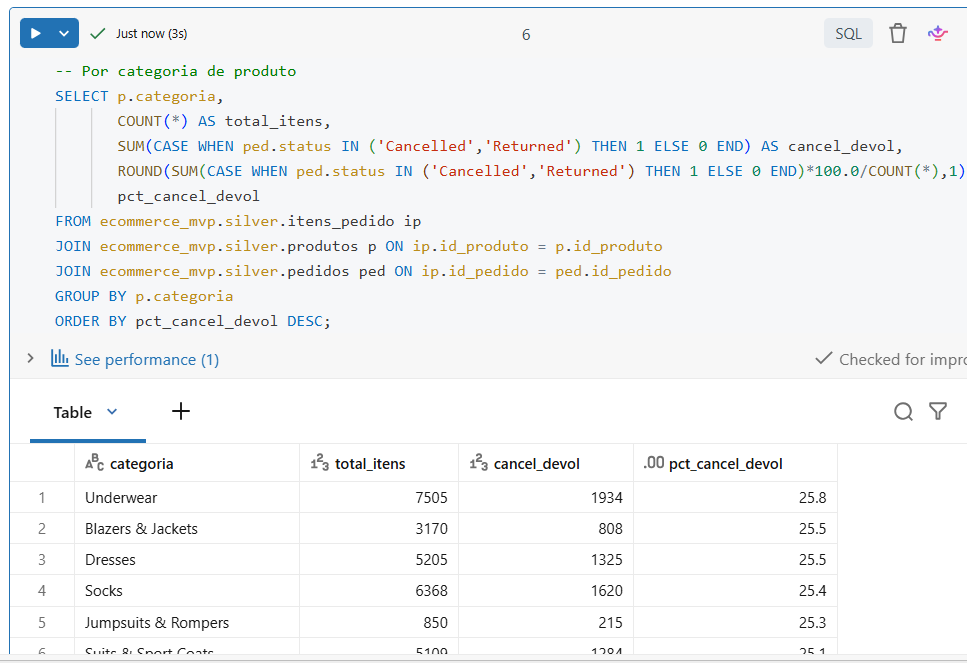

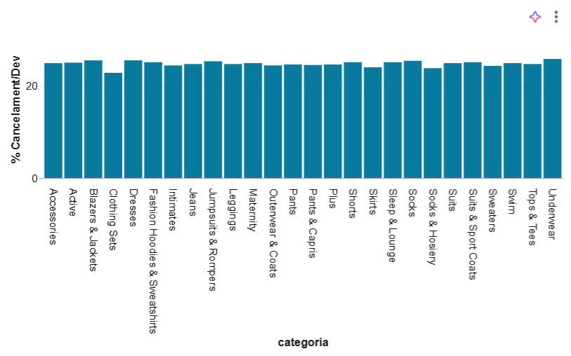

### B. Mix de produtos e lucratividade

**Pergunta 4 — Mix de produtos mais vendido**
```sql
SELECT categoria, SUM(unidades_vendidas_total) AS unidades,
       CAST(ROUND(SUM(receita_total),2) AS DECIMAL(10,2)) AS receita
FROM ecommerce_mvp.gold.giro_vendas_produto
GROUP BY categoria
ORDER BY receita DESC;
```
Por receita, as categorias líderes são **Outerwear & Coats** (US$ 990 mil, 6.813 unidades), **Jeans** (US$ 941 mil, 9.622 unidades) e **Sweaters** (US$ 636 mil). Jeans lidera em volume de unidades, mas Outerwear & Coats lidera em receita — sinal de ticket médio mais alto nessa categoria.

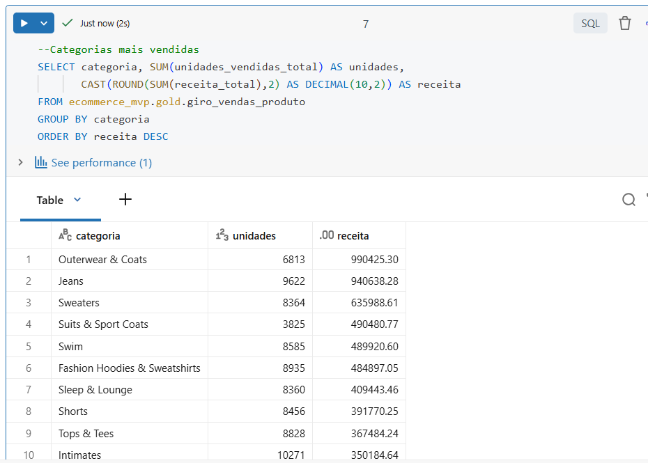

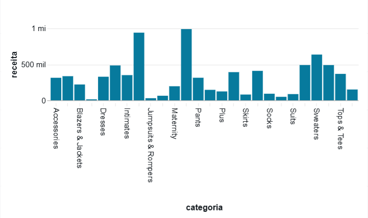

**Pergunta 5 — Margem por categoria**
```sql
SELECT categoria,
       COUNT(*) AS unidades,
       CAST(ROUND(SUM(margem),2) AS DECIMAL(10,2)) AS margem_total,
       CAST(ROUND(AVG(margem),2) AS DECIMAL(10,2)) AS margem_media_unidade,
       ROUND(SUM(margem)*100.0/SUM(preco_venda),1) AS pct_margem
FROM ecommerce_mvp.gold.fato_vendas
GROUP BY categoria
ORDER BY pct_margem DESC;
```
As categorias com **maior percentual de margem** são **Blazers & Jackets** (62,1% de margem sobre a receita), **Skirts** (60,2%) e **Suits & Sport Coats** (59,8% de margem, com a maior margem em valor absoluto por unidade: US$ 76,69). *Blazers & Jackets e Suits & Sport Coats seriam bons candidatos a investimento em mídia/destaque, pois cada venda adicional carrega uma margem proporcionalmente maior do que a média do mix.*

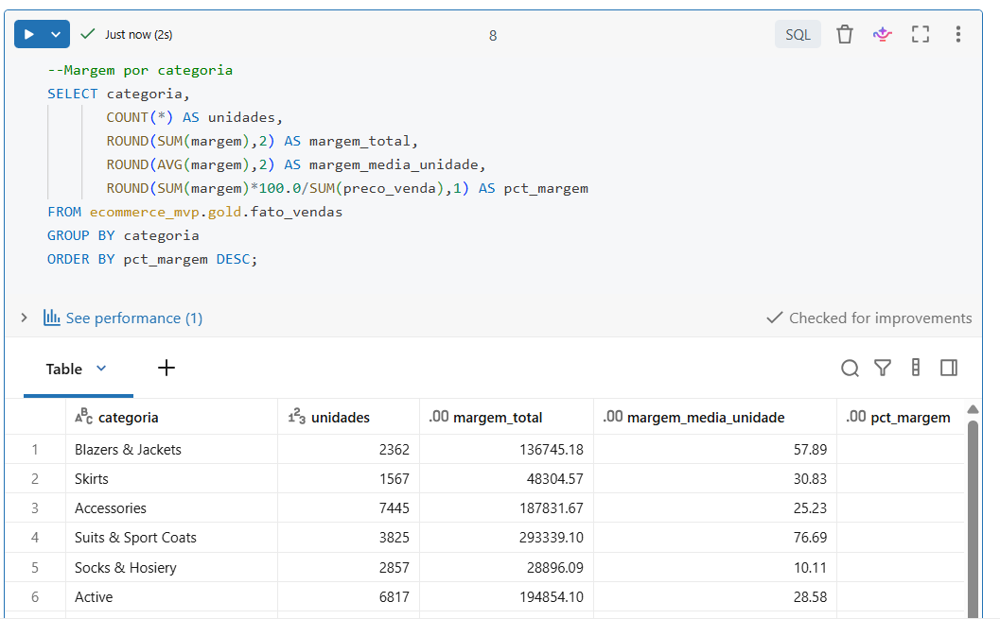

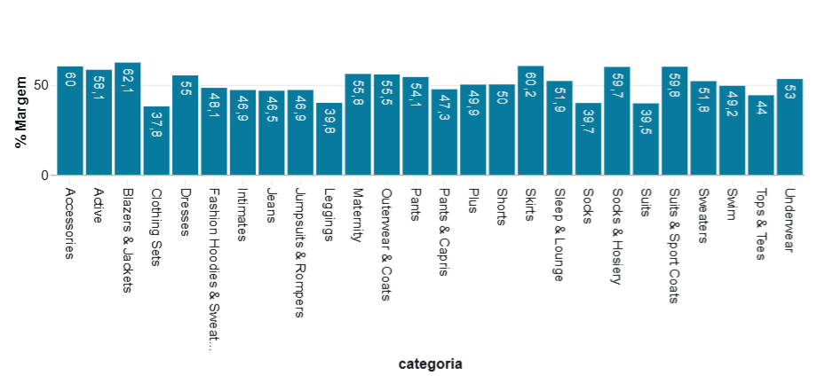

**Pergunta 6 — Desempenho por departamento (Men vs. Women)**
```sql
SELECT departamento,
       COUNT(*) AS unidades,
       CAST(ROUND(SUM(preco_venda),2) AS DECIMAL(10,2)) AS receita,
       CAST(ROUND(SUM(margem),2) AS DECIMAL(10,2)) AS margem_total,
       ROUND(SUM(margem)*100.0/SUM(preco_venda),1) AS pct_margem
FROM ecommerce_mvp.gold.fato_vendas
GROUP BY departamento
ORDER BY receita DESC;
```
Os departamentos têm desempenho muito próximo: Men gera US$ 4.308.255 (51,8% de margem) contra US$ 3.777.716 de Women (52,0% de margem), com volume de unidades quase idêntico (67.186 vs. 67.738). *Não há uma divisão de negócio dominante — a estratégia comercial deve tratar os dois departamentos como igualmente relevantes.*

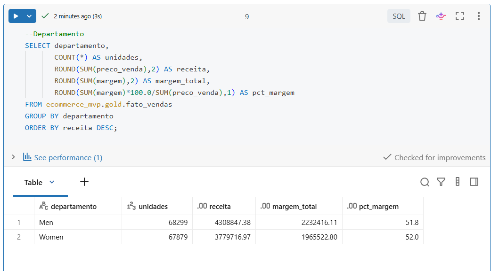

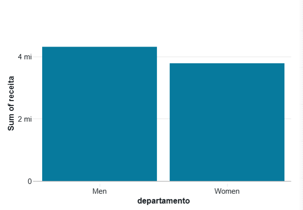

### C. Estoque e operação logística

**Pergunta 7 — Cobertura de estoque dos mais vendidos**
```sql
SELECT g.id_produto, p.nome_produto, g.categoria,
       g.unidades_vendidas_90d, COALESCE(e.unidades_em_estoque, 0) AS estoque_atual,
       CASE WHEN COALESCE(e.unidades_em_estoque,0) = 0 THEN NULL
            ELSE ROUND(g.unidades_vendidas_90d / e.unidades_em_estoque, 2) END AS indice_giro
FROM ecommerce_mvp.gold.giro_vendas_produto g
LEFT JOIN ecommerce_mvp.gold.estoque_atual e ON g.id_produto = e.id_produto
JOIN ecommerce_mvp.gold.dim_produto p ON g.id_produto = p.id_produto
ORDER BY g.unidades_vendidas_90d DESC
LIMIT 20;
```
Ao cruzar as vendas dos últimos 90 dias com o estoque atual, os produtos mais vendidos têm índice de giro (vendas 90d ÷ estoque atual) sempre **abaixo de 0,5** — ou seja, o estoque atual é o dobro (ou mais) da demanda recente. Não há risco aparente de ruptura entre os best-sellers; ao contrário, há sinal de estoque folgado mesmo nos produtos mais vendidos.*

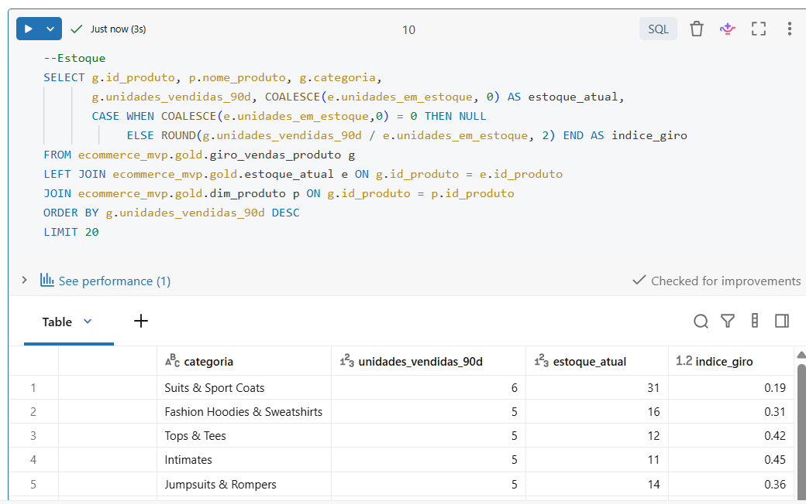

**Pergunta 8 — Produtos com estoque parado**
```sql
SELECT COUNT(*) AS produtos_com_estoque,
       SUM(CASE WHEN dias_medios_parado > 90 THEN 1 ELSE 0 END) AS produtos_parados_90d,
       ROUND(AVG(dias_medios_parado),1) AS media_geral_dias
FROM ecommerce_mvp.gold.estoque_atual;

SELECT e.id_produto, p.nome_produto, e.unidades_em_estoque, e.dias_medios_parado
FROM ecommerce_mvp.gold.estoque_atual e
JOIN ecommerce_mvp.gold.dim_produto p ON e.id_produto = p.id_produto
WHERE e.dias_medios_parado > 90
ORDER BY e.dias_medios_parado DESC;
```
Este é o achado mais crítico do trabalho: **29.032 dos 29.043 produtos com estoque (99,96%)** têm unidades paradas há mais de 90 dias, com média geral de **1.229 dias (~3,4 anos)** parado. Os casos mais extremos passam de 2.400 dias parados. *Interpretação: praticamente todo o estoque da loja está "velho" em relação à data atual — isso é coerente com um dataset gerado continuamente desde 2019 sem giro proporcional de baixa de estoque, sinal de alarme de capital parado em nível de todo o catálogo, não apenas de produtos pontuais.*

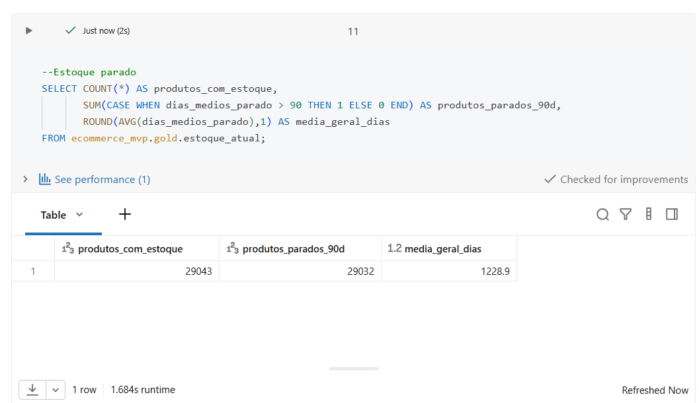

**Pergunta 9 — Tempo médio de entrega (geral e por centro de distribuição)**
```sql
SELECT ROUND(AVG(DATEDIFF(data_entrega, data_pedido)),1) AS dias_medios_entrega,
       COUNT(*) AS pedidos_entregues
FROM ecommerce_mvp.silver.pedidos
WHERE data_entrega IS NOT NULL;

SELECT cd.nome AS centro_distribuicao,
       COUNT(DISTINCT ped.id_pedido) AS pedidos,
       ROUND(AVG(DATEDIFF(ped.data_entrega, ped.data_pedido)),1) AS dias_medios_entrega
FROM ecommerce_mvp.silver.pedidos ped
JOIN ecommerce_mvp.silver.itens_pedido ip ON ped.id_pedido = ip.id_pedido
JOIN ecommerce_mvp.silver.produtos p ON ip.id_produto = p.id_produto
JOIN ecommerce_mvp.silver.centros_distribuicao cd ON p.id_centro_distribuicao = cd.id_centro_distribuicao
WHERE ped.data_entrega IS NOT NULL
GROUP BY cd.nome
ORDER BY dias_medios_entrega DESC;
```
O tempo médio entre criação do pedido e entrega é de **4,0 dias**, e esse valor é **idêntico (4,0 dias) em todos os 10 centros de distribuição** analisados. *A operação logística está padronizada — não há um centro de distribuição "gargalo" a ser priorizado para otimização de prazo.*

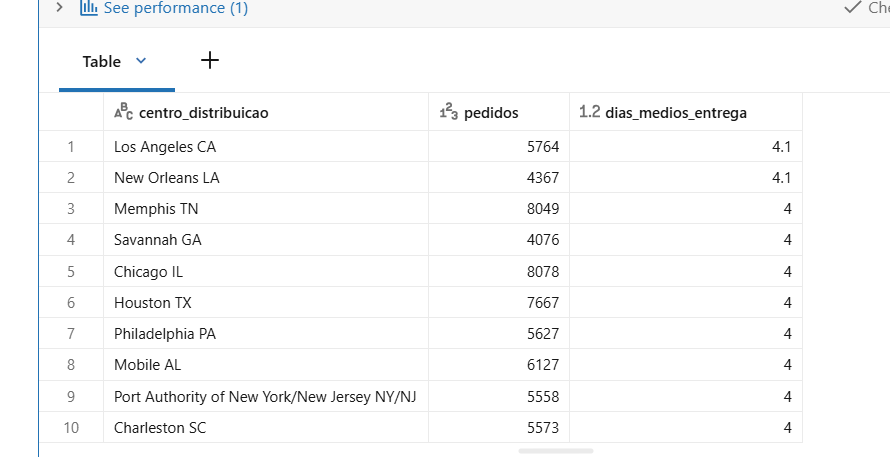

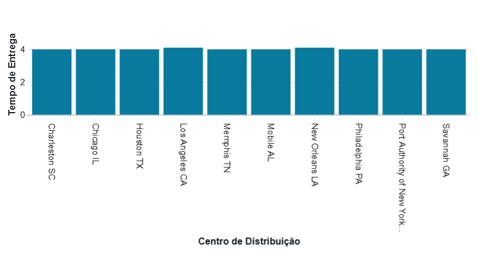

**Pergunta 10 — Centro de distribuição x taxa de cancelamento**
```sql
SELECT cd.nome AS centro_distribuicao,
       COUNT(DISTINCT ped.id_pedido) AS pedidos,
       ROUND(SUM(CASE WHEN ped.status IN ('Cancelled','Returned') THEN 1 ELSE 0 END)*100.0
             / COUNT(DISTINCT ped.id_pedido), 1) AS pct_cancel_devol
FROM ecommerce_mvp.silver.pedidos ped
JOIN ecommerce_mvp.silver.itens_pedido ip ON ped.id_pedido = ip.id_pedido
JOIN ecommerce_mvp.silver.produtos p ON ip.id_produto = p.id_produto
JOIN ecommerce_mvp.silver.centros_distribuicao cd ON p.id_centro_distribuicao = cd.id_centro_distribuicao
GROUP BY cd.nome
ORDER BY pct_cancel_devol DESC;
```
A taxa de cancelamento/devolução por centro de distribuição varia pouco, entre 26,6% e 25,3% — sem um centro claramente pior que os demais. *Assim como no tempo de entrega, não há evidência de que a origem logística explique parte relevante do cancelamento — a causa provavelmente está em outro fator (ex: processo de pagamento, qualidade do produto).*

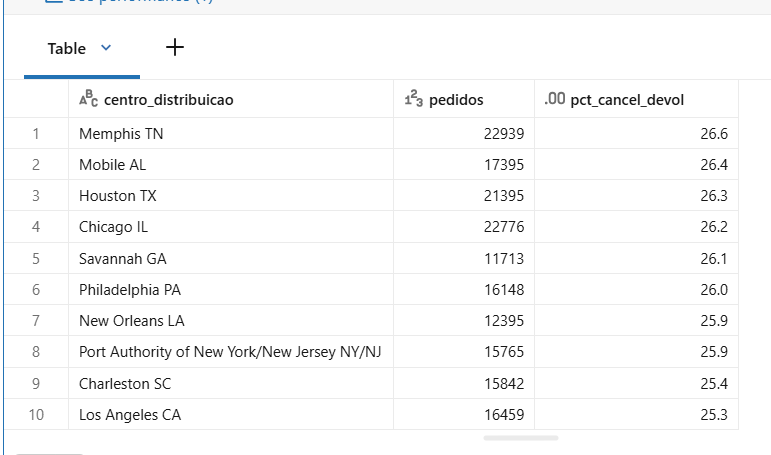

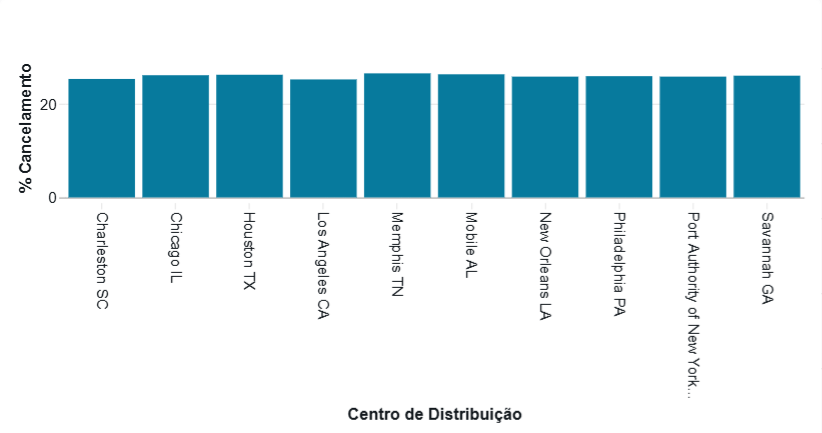

### D. CRM e ciclo de vida do cliente

**Pergunta 11 — Tempo médio até a recompra**
```sql
SELECT ROUND(AVG(MONTHS_BETWEEN(mes, mes_anterior)), 1) AS meses_medios_ate_recompra
FROM (
    SELECT id_cliente, mes,
           LAG(mes) OVER (PARTITION BY id_cliente ORDER BY mes) AS mes_anterior
    FROM (SELECT DISTINCT id_cliente, DATE_TRUNC('month', data_venda) AS mes FROM ecommerce_mvp.gold.fato_vendas)
) t
WHERE mes_anterior IS NOT NULL;
```
Entre clientes que compraram mais de uma vez, o tempo médio até a próxima compra é de **13,1 meses** — pouco mais de um ano. *O ciclo de recompra natural é longo; uma campanha de reativação disparada cedo demais (ex: em 2 meses) provavelmente terá baixa efetividade, já que boa parte da base simplesmente ainda não estaria "no tempo" de comprar de novo. Ideal ter uma campanha que atinge os clientes perto do prazo e 13 meses.*

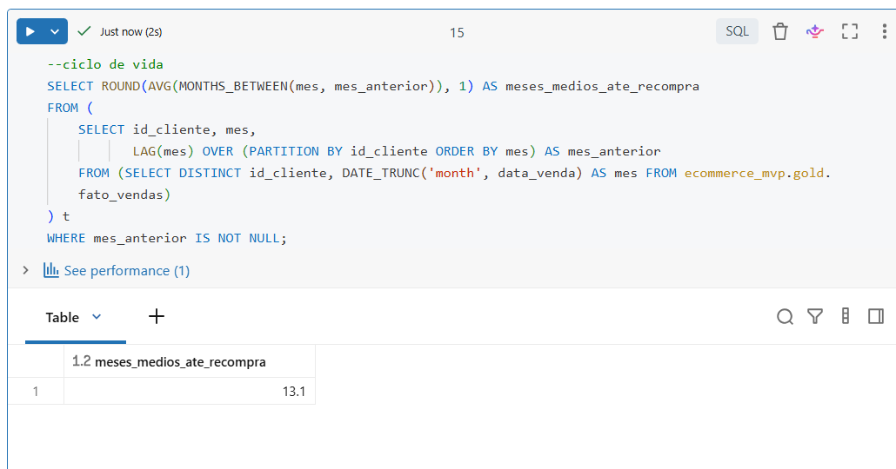

**Pergunta 12 — Distribuição novo/retido/reativado por mês**
```sql
SELECT date_format(mes, 'MM/yyyy') AS mes, classificacao, qtd_clientes
FROM (
    SELECT mes, classificacao, count(*) AS qtd_clientes
    FROM ecommerce_mvp.gold.ciclo_vida_cliente
    GROUP BY mes, classificacao
) t
ORDER BY t.mes;

-- Distribuição percentual agregada (todos os meses)
SELECT classificacao, count(*) AS qtd,
       ROUND(count(*)*100.0/SUM(count(*)) OVER(),1) AS pct
FROM ecommerce_mvp.gold.ciclo_vida_cliente
GROUP BY classificacao
ORDER BY qtd DESC;
```
Das observações mensais de clientes, **71,2% são "Novo"**, **22,1% são "Reativado"** e apenas **6,7% são "Retido"**. *A retenção de curto prazo (compra novamente em até 2 meses) é rara — a maior parte da receita recorrente vem de clientes "reativados" após um hiato, reforçando o achado da pergunta 11 de que o ciclo de recompra é naturalmente longo.*

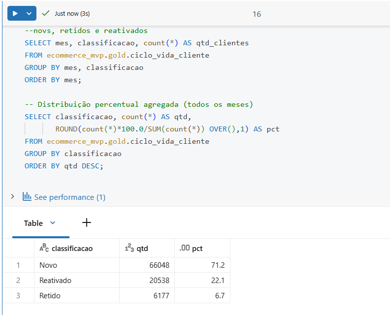

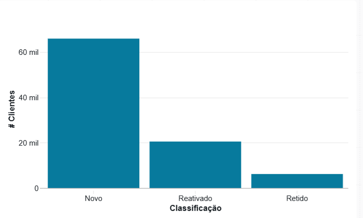

**Pergunta 13 — Base de clientes para CRM**
```sql
SELECT segmento_crm, count(*) AS qtd_clientes,
       CAST(ROUND(AVG(receita_total_cliente),2) AS DECIMAL(10,2)) AS receita_media
FROM ecommerce_mvp.gold.base_crm
GROUP BY segmento_crm;

-- lista de clientes para o segmento "Alvo de reativação"
SELECT * FROM ecommerce_mvp.gold.base_crm WHERE segmento_crm = 'Alvo de reativação';
```
A segmentação identificou **12.106 clientes "Alvo de reativação"** (mais de 180 dias sem comprar, com histórico de mais de 1 pedido) com receita histórica média de **US$ 200,82**, e **2.713 "Clientes recorrentes de valor"** (3+ pedidos) com receita média de **US$ 283,97** — o segmento de maior valor por cliente, ainda que o menor em quantidade. *O segmento "Alvo de reativação" é o mais numeroso e representa a maior oportunidade agregada de receita recuperável via CRM.*

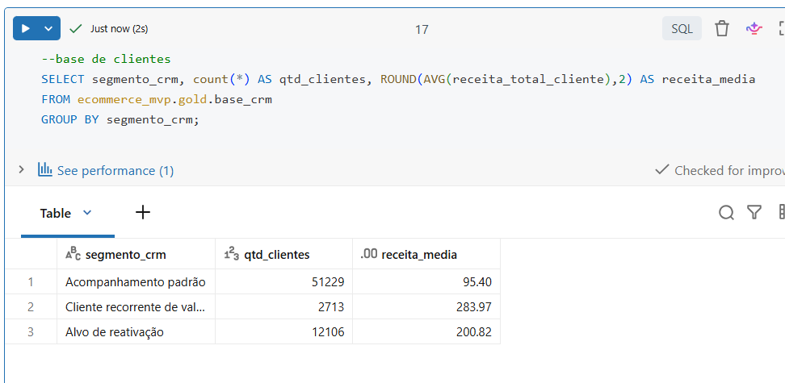

### E. Aquisição e perfil de clientes

**Pergunta 14 — Canal de aquisição x valor do cliente**
```sql
SELECT c.origem_trafego,
       COUNT(DISTINCT c.id_cliente) AS clientes,
       ROUND(COUNT(DISTINCT c.id_cliente)*100.0/SUM(COUNT(DISTINCT c.id_cliente)) OVER(),1) AS pct_clientes,
       CAST(ROUND(SUM(v.preco_venda),2) AS DECIMAL(10,2)) AS receita_total,
       CAST(ROUND(SUM(v.preco_venda)/COUNT(DISTINCT c.id_cliente),2) AS DECIMAL(10,2)) AS receita_media_por_cliente
FROM ecommerce_mvp.gold.dim_cliente c
LEFT JOIN ecommerce_mvp.gold.fato_vendas v ON c.id_cliente = v.id_cliente
GROUP BY c.origem_trafego
ORDER BY clientes DESC;
```
**Search** domina a aquisição de clientes (70% da base, 69.926 clientes), seguido por **Organic** (14,9%). A receita média por cliente, porém, é bastante uniforme entre canais (US$ 80,36 a US$ 85,06), com **Display** ligeiramente à frente (US$ 85,06) apesar de trazer o menor volume (4,1% da base).

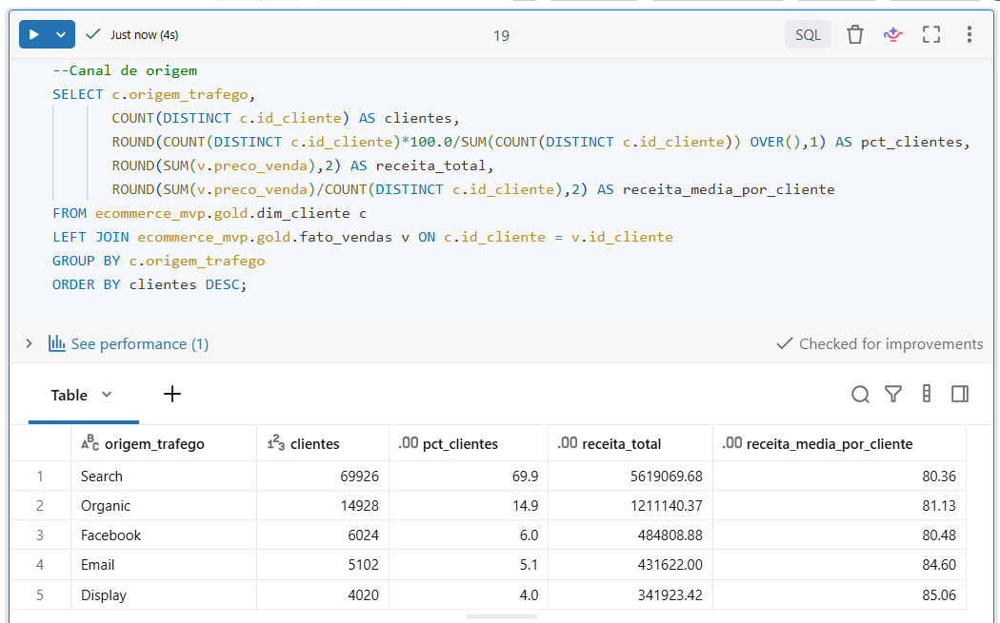

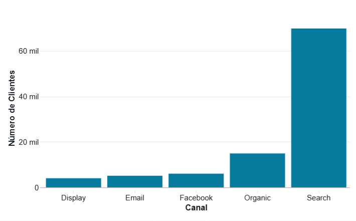

**Pergunta 15 — Distribuição geográfica da receita**
```sql
SELECT c.pais, COUNT(DISTINCT v.id_cliente) AS clientes,
       CAST(ROUND(SUM(v.preco_venda),2) AS DECIMAL(10,2)) AS receita
FROM ecommerce_mvp.gold.fato_vendas v
JOIN ecommerce_mvp.gold.dim_cliente c ON v.id_cliente = c.id_cliente
GROUP BY c.pais
ORDER BY receita DESC;
```
A receita está concentrada em poucos países entre os 16 atendidos: **China** lidera (US$ 2,69M, 22.166 clientes), seguida por **Estados Unidos** (US$ 1,82M) e **Brasil** (US$ 1,18M) Mais da metade da receita vem dos 3 maiores mercados; os demais 13 países representam uma cauda longa com potencial de crescimento ainda pouco explorado.*

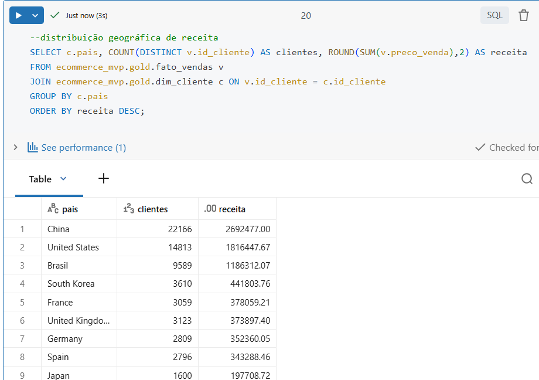

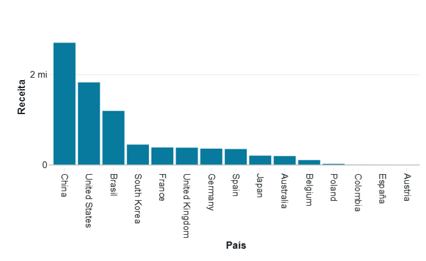

**Pergunta 16 — Perfil demográfico x categorias (gênero e faixa etária)**
```sql
-- Por gênero
SELECT c.genero, v.categoria, COUNT(*) AS unidades
FROM ecommerce_mvp.gold.fato_vendas v
JOIN ecommerce_mvp.gold.dim_cliente c ON v.id_cliente = c.id_cliente
GROUP BY c.genero, v.categoria
QUALIFY ROW_NUMBER() OVER (PARTITION BY c.genero ORDER BY COUNT(*) DESC) <= 5
ORDER BY c.genero, unidades DESC;

-- Por faixa etária x departamento
SELECT
  CASE WHEN c.idade < 25 THEN '<25' WHEN c.idade < 40 THEN '25-39'
       WHEN c.idade < 55 THEN '40-54' ELSE '55+' END AS faixa_etaria,
  v.departamento, COUNT(*) AS unidades
FROM ecommerce_mvp.gold.fato_vendas v
JOIN ecommerce_mvp.gold.dim_cliente c ON v.id_cliente = c.id_cliente
GROUP BY faixa_etaria, v.departamento
ORDER BY faixa_etaria, v.departamento;
```
Por gênero, a diferença é marcante — mulheres compram principalmente **Intimates** (10.271 unidades, muito à frente da 2ª colocada), enquanto homens tem todas as categorias em volumes mais equilibrados entre si. Já por **faixa etária**, a distribuição entre departamentos Men/Women é praticamente idêntica em todas as faixas (12–24, 25–39, 40–54, 55+). *Gênero é uma variável relevante para segmentação de campanhas de produto; idade, isoladamente, não é.*

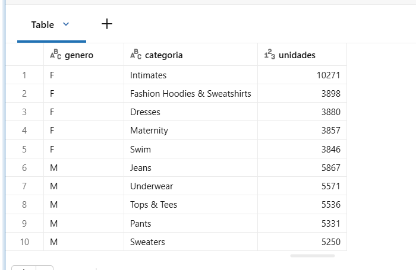

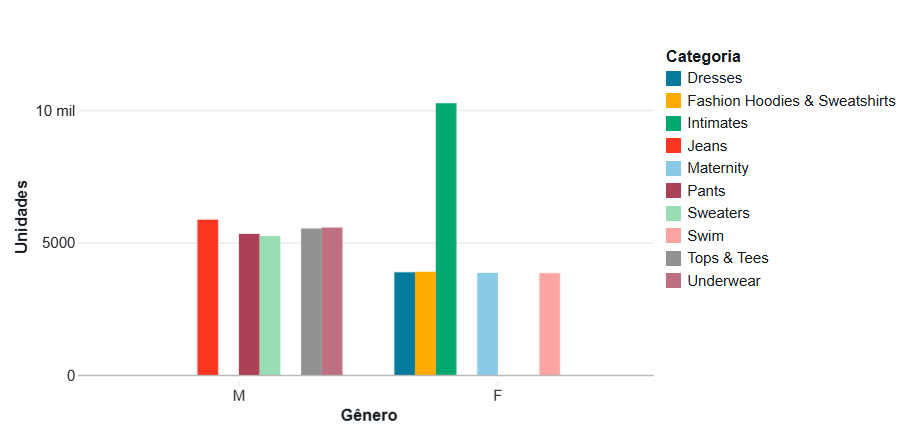

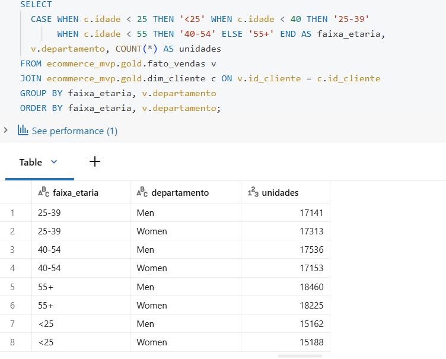


### F. Funil de conversão

**Pergunta 17 — Taxa de conversão do funil (produto → carrinho → compra)**
```sql
SELECT
    COUNT(*) AS total_sessoes,
    SUM(viu_produto) AS sessoes_viram_produto,
    SUM(adicionou_carrinho) AS sessoes_add_carrinho,
    SUM(comprou) AS sessoes_compraram,
    ROUND(SUM(adicionou_carrinho) / NULLIF(SUM(viu_produto), 0) * 100, 1) AS pct_produto_para_carrinho,
    ROUND(SUM(comprou) / NULLIF(SUM(adicionou_carrinho), 0) * 100, 1) AS pct_carrinho_para_compra,
    ROUND(SUM(comprou) / NULLIF(SUM(viu_produto), 0) * 100, 1) AS pct_produto_para_compra
FROM ecommerce_mvp.gold.funil_conversao;
```
De **681.183 sessões** que visualizaram algum produto, **63,2%** adicionaram algo ao carrinho, e destas, **41,9%** finalizaram a compra — uma conversão geral de **26,5%** de visualização de produto até compra. *A maior perda do funil está entre "adicionar ao carrinho" e "finalizar a compra" (58,1% de abandono nessa etapa), sugerindo que o esforço de otimização deveria focar no processo de checkout/pagamento, não na página de produto.*

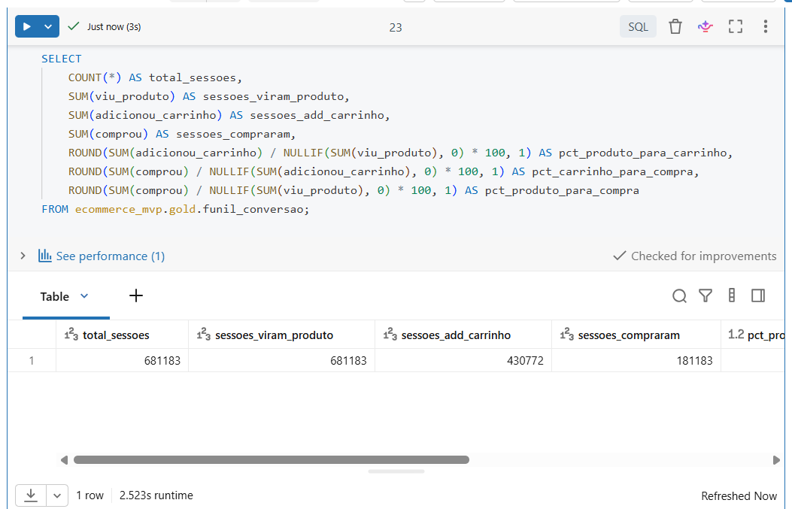

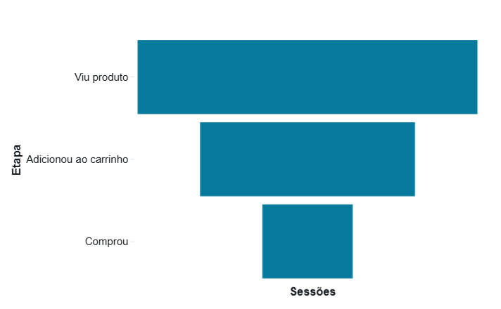

**Pergunta 18 — Conversão do funil por canal de origem**
```sql
SELECT
    origem_trafego,
    COUNT(*) AS total_sessoes,
    SUM(viu_produto) AS sessoes_viram_produto,
    SUM(comprou) AS sessoes_compraram,
    ROUND(SUM(comprou) / NULLIF(SUM(viu_produto), 0) * 100, 1) AS pct_conversao
FROM ecommerce_mvp.gold.funil_conversao
GROUP BY origem_trafego
ORDER BY pct_conversao DESC;
```
A taxa de conversão é praticamente **idêntica entre canais**  uma variação de apenas 0,2 ponto percentual entre o melhor e o pior canal. *Diferente da pergunta 14 (onde o valor por cliente variava um pouco por canal), aqui a eficiência de conversão dentro da sessão é praticamente igual — o que diferencia os canais é volume de tráfego trazido, não a qualidade da conversão.*

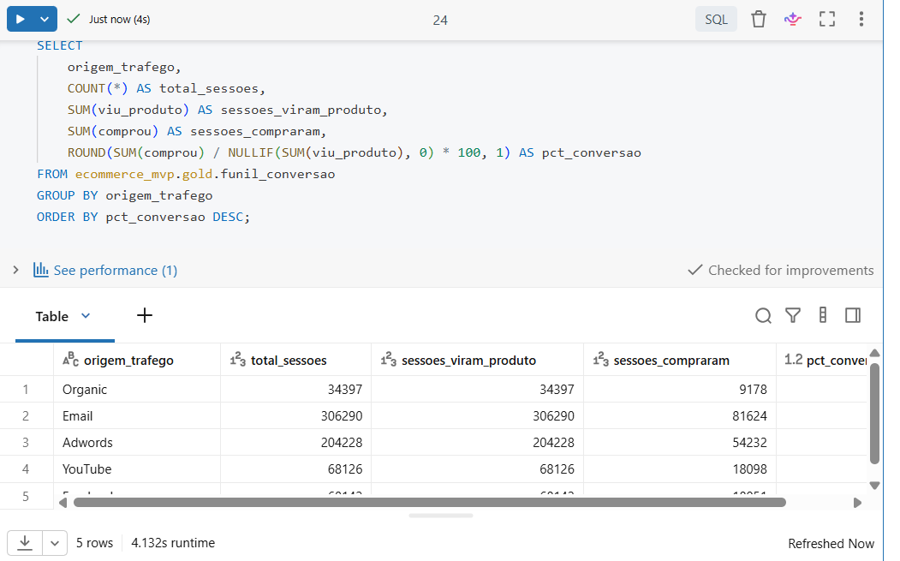

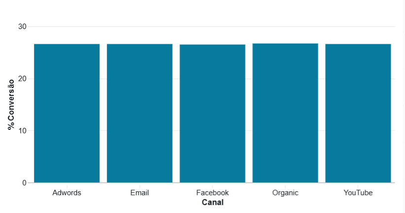

### Discussão geral

### 1. O crescimento é real, mas está sendo puxado por aquisição, não por retenção

A receita mensal está em trajetória de aceleração clara (Pergunta 1) — setembro/2026, mesmo parcial, já supera agosto/2026 inteiro (US$ 618 mil vs. US$ 359 mil). À primeira vista, isso parece uma vitória. Mas ao cruzar com o ciclo de vida do cliente (Pergunta 12: 71,2% "Novo", apenas 6,7% "Retido") e o tempo médio de recompra (Pergunta 11: 13,1 meses), fica claro que **esse crescimento é movido quase inteiramente por aquisição de clientes novos**, não por uma base fiel comprando com mais frequência. Isso é um alerta estratégico: uma receita que cresce por volume de aquisição é mais frágil e mais cara de sustentar (cada real de crescimento depende de continuar captando gente nova) do que uma receita que cresce por LTV (lifetime value) da base existente. Sem uma mudança deliberada em CRM, esse padrão tende a se manter — e o custo de aquisição (CAC), que este dataset não contém, se torna a métrica mais crítica a monitorar daqui para frente (ver limitação abaixo).

### 2. O gargalo não é logística — é o checkout

Um dos cruzamentos mais reveladores do trabalho: tempo de entrega (Pergunta 9: 4,0 dias, idêntico em todos os 10 centros), taxa de cancelamento por centro de distribuição (Pergunta 10: 25,3%–26,6%, uniforme) e taxa de cancelamento por categoria (Pergunta 3: 25%–26%, uniforme) mostram uma operação **logisticamente homogênea e sem gargalos identificáveis**. Isso descarta a hipótese óbvia ("a entrega está lenta" ou "um centro específico está com problema"). Ao mesmo tempo, o funil de conversão (Pergunta 17) mostra que **58,1% de quem coloca item no carrinho não finaliza a compra** — e essa perda é uniforme entre canais de origem (Pergunta 18: variação de só 0,2 p.p.). Juntando os três achados: o problema de conversão/cancelamento do negócio não está em onde o cliente veio, nem em qual centro despacha o produto — está estruturalmente no processo entre "carrinho" e "pagamento confirmado". Isso reorienta prioridade de investimento: revisar o fluxo de checkout (meios de pagamento, fricção de cadastro, custos de frete surpresa) tem potencial de impacto muito maior do que otimizar operação logística, que já está no ponto.

### 3. Mix de produtos: volume e margem apontam para categorias diferentes

Cruzando a Pergunta 4 (mix mais vendido: Jeans lidera em unidades com 9.622, Outerwear & Coats lidera em receita com US$ 990 mil) com a Pergunta 5 (margem: Blazers & Jackets (62,1%), Skirts (60,2%) e Suits & Sport Coats (59,8%, com a maior margem absoluta por unidade: US$ 76,69) têm os maiores percentuais de margem, mas não aparecem no topo de volume), surge uma oportunidade clássica de portfólio: a loja está investindo atenção (e provavelmente mídia) nas categorias de maior volume, mas as categorias mais lucrativas proporcionalmente estão "escondidas" no meio do catálogo. Uma estratégia de merchandising que desloque uma fração do destaque de Jeans/Outerwear para Blazers & Jackets/Suits & Sport Coats aumentaria a margem média do mix sem exigir crescimento de receita bruta. A Pergunta 6 (Men: US$ 4.308.255 com 51,8% de margem; Women: US$ 3.777.716 com 52,0% de margem, volumes praticamente idênticos) reforça que essa priorização de categoria deve ser feita dentro de cada departamento, não entre eles — não há um departamento "mais lucrativo" a favorecer.

### 4. Estoque: o maior risco financeiro identificado no trabalho

Este é o achado mais grave do conjunto: 99,96% dos produtos com estoque (29.032 de 29.043) estão parados há mais de 90 dias, com média de 1.229 dias (Pergunta 8) — e isso acontece **mesmo nos produtos mais vendidos**, que têm índice de giro sempre abaixo de 0,5 (Pergunta 7, ou seja, o estoque atual é o dobro ou mais da demanda de 90 dias). Cruzando os dois achados, a conclusão é dura: não é que os produtos parados sejam só os "encalhados" óbvios — **até o que vende bem está sobre-estocado**. Isso indica uma desconexão sistêmica entre compras/reposição e a demanda real medida pelos dados, não um problema pontual de um SKU ou categoria. Do ponto de vista de negócio, capital parado em estoque tem custo de oportunidade direto (dinheiro que poderia estar em marketing, tecnologia ou expansão geográfica) — a ação recomendada não é uma liquidação pontual, mas **redesenhar o processo de reposição para ser orientado a `giro_vendas_produto` em vez de calendário ou intuição**.

### 5. CRM: a base "Alvo de reativação" é a alavanca mais clara de receita incremental

A segmentação (Pergunta 13) mostra 12.106 clientes "Alvo de reativação" (receita histórica média de US$ 200,82) contra apenas 2.713 "Clientes recorrentes de valor" (US$ 283,97 de receita média, o segmento de maior valor per capita, mas pequeno). Cruzando com a Pergunta 11 (13,1 meses até a recompra) e a Pergunta 12 (retenção de curto prazo é rara), a leitura correta não é "por que tão poucos retornam em 2 meses" — é que **o ciclo natural desse negócio é anual**, então uma campanha de reativação bem-sucedida deveria ser calendarizada em torno da marca de ~13 meses após a última compra, não disparada cedo demais (o que explicaria campanhas de reativação de baixa efetividade, se existirem). Como o segmento "Alvo de reativação" é o mais numeroso, ele representa a maior oportunidade agregada — mesmo com ticket médio individual mais baixo que o "recorrente de valor", o volume compensa.

### 6. Aquisição e geografia: concentração alta, com cauda longa inexplorada

Search domina a aquisição (70% da base, 69.926 clientes, Pergunta 14), mas a receita média por cliente é homogênea entre canais — com Display se destacando por trazer o cliente de maior valor médio (US$ 85,06), apesar do menor volume (4,1% da base). Isso sugere testar um aumento incremental (não uma migração de orçamento) para Display, monitorando se o valor por cliente se mantém em escala maior. Geograficamente (Pergunta 15), China (US$ 2,69M, 22.166 clientes), Estados Unidos (US$ 1,82M) e Brasil (US$ 1,18M) concentram a maior parte da receita entre 16 países atendidos — os 13 países restantes formam uma cauda longa que já está "conectada" (a loja já vende lá) mas pouco explorada: expandir ali tem custo marginal menor do que entrar em mercados novos.

### 7. Perfil demográfico: segmentar por gênero, não por idade

A Pergunta 16 mostra que gênero é uma variável de segmentação forte (mulheres concentradas em Intimates, com 10.271 unidades, muito à frente da 2ª colocada; homens com volumes mais equilibrados entre as categorias, sem uma concentração tão marcante), enquanto faixa etária não muda a proporção Men/Women de forma relevante. Isso significa que campanhas de CRM e recomendação de produto ganham mais precisão segmentando por gênero + histórico de categoria do que por faixa etária — simplificando a régua de personalização.

### Síntese: as três prioridades que emergem do cruzamento de tudo

1. **Checkout, não logística** — o dinheiro "vazando" está entre carrinho e compra (Pergunta 17), de forma uniforme entre canais e centros; é aqui que uma correção pontual tem o maior efeito multiplicador sobre receita já capturada.
2. **Reposição de estoque orientada a dado, não a calendário** — o desalinhamento entre giro e volume comprado (Perguntas 7 e 8) representa capital parado em praticamente todo o catálogo, não um problema de cauda longa.
3. **CRM calendarizado ao ciclo real do cliente (~13 meses)**, mirando a base "Alvo de reativação" (Pergunta 13) como prioridade de volume, com Display como aposta incremental de maior valor por cliente (Pergunta 14).

### Limitação que atravessa toda a discussão

Nenhuma dessas conclusões pode ser cruzada com **satisfação do cliente** (Pergunta 19, não respondida) — não é possível saber se o cancelamento no checkout, a baixa recompra ou a escolha de categoria têm relação com percepção de qualidade, preço ou experiência de entrega. Esse é o dado que mais mudaria a priorização acima se estivesse disponível: por exemplo, se o abandono no checkout estiver ligado a frete/prazo percebido como caro, a correção é de precificação de frete, não de UX de pagamento.

---

## 7. Autoavaliação

**Objetivos atingidos:** das 19 perguntas formuladas na etapa de Objetivo, 18 foram respondidas com dados concretos extraídos do dataset, cobrindo os 6 blocos temáticos propostos (KPIs, mix de produtos, estoque, CRM, aquisição e funil de conversão). O objetivo de construir um pipeline completo Bronze → Silver → Gold, com catálogo de dados documentado também foi atingido.

**Limitações:** A pergunta 19 (satisfação do cliente com base em avaliações) não pôde ser respondida, pois o TheLook eCommerce não disponibiliza uma tabela de reviews — apenas dados de pedidos, produtos, estoque e eventos de navegação.

**Dificuldades encontradas:** [descreva as dificuldades específicas que você teve durante a execução — ex: configuração inicial do BigQuery/Databricks, curva de aprendizado com SQL/Spark, etc.]

**Trabalhos futuros:**

### 1. Fechar a lacuna de satisfação do cliente (Pergunta 19)

Esta é a limitação mais citada ao longo do trabalho, e dá para atacá-la de duas formas concretas:
- **Fonte complementar real:** buscar um dataset de reviews de e-commerce de moda (existem opções abertas no Kaggle, como reviews da Amazon Fashion ou de outros marketplaces) e tentar uma junção aproximada por categoria/departamento, mesmo sem chave direta com o `id_cliente` — permite pelo menos estimar padrões de satisfação por tipo de produto.
- **Simulação controlada:** gerar uma pesquisa de satisfação sintética (ex: nota de 1 a 5 correlacionada propositalmente com `tempo_entrega` e `status` do pedido) só para exercitar a modelagem de uma tabela `gold.satisfacao_cliente` e as consultas que a acompanhariam — deixando claro no relatório que é dado simulado, não real, mas que fecha o ciclo metodológico da pergunta que ficou em aberto.

### 2. Custo de aquisição (CAC) e retorno por canal

A Pergunta 14 mostrou receita por canal, mas não o **custo** de trazer cada cliente — sem isso, não dá para saber se Search (70% do volume) é realmente o canal mais eficiente ou só o mais barato de medir. Próximo passo: incorporar uma tabela `gold.custo_aquisicao` (mesmo que com valores estimados/de mercado por canal, documentando a fonte) para calcular CAC e LTV/CAC por `traffic_source`, transformando o achado atual ("Display tem cliente de maior valor") em uma decisão de orçamento real.

### 3. Investigar a causa raiz do estoque parado (Pergunta 8)

O achado de que 99,96% dos produtos estão com estoque parado é forte, mas o dataset não tem histórico de **reposição** (quando e por que cada lote foi comprado). Trabalho futuro: simular ou buscar uma tabela de `compras_fornecedor` (data do pedido de compra, lead time, quantidade) para calcular se a política de reposição está desalinhada com o `giro_vendas_produto` — e a partir disso, propor uma regra de ponto de pedido (reorder point) baseada em giro real, não em calendário fixo.

### 4. Aprofundar o funil de conversão com dados de tempo

Hoje o funil (Perguntas 17–18) só mede *se* a sessão chegou em cada estágio, não *quanto tempo* ficou em cada um. Como a tabela `events` tem `sequence_number` e `created_at` por evento, dá para calcular o tempo entre "adicionar ao carrinho" e "compra" (ou o abandono) por sessão, e cruzar com `browser` — permitindo identificar, por exemplo, se o abandono é maior em determinado navegador/dispositivo, o que aponta para um problema técnico específico de checkout, não só comportamental.

### 5. Análise de cesta de compras (cross-sell / up-sell)

A tabela `order_items` permite montar pares de produtos comprados juntos no mesmo pedido (market basket analysis, ex: regras de associação tipo "quem compra Jeans também compra Belts"). Isso abriria uma frente de análise que não foi explorada nas 18 perguntas originais e tem aplicação direta em recomendação de produto e bundle de ofertas.

### 6. Modelo preditivo de churn / propensão de recompra

A tabela `gold.ciclo_vida_cliente` já classifica retroativamente novo/retido/reativado — o próximo passo natural é treinar um modelo simples (ex: regressão logística ou árvore de decisão) que **preveja**, para cada cliente ativo hoje, a probabilidade de virar "reativado" vs. permanecer inativo, usando como features `dias_desde_ultima_compra`, `total_pedidos`, `origem_trafego`, categoria preferida. Isso transformaria o CRM de reativo (Pergunta 13) para preditivo.

### 7. Automatizar e tornar a pipeline incremental

Hoje toda tabela é recriada do zero (`CREATE OR REPLACE TABLE`) a cada execução, o que funciona para o MVP mas não escala para um cenário real com atualização diária. Trabalho futuro: reescrever a ingestão Bronze e as transformações Silver/Gold em modo incremental (ex: usando `MERGE INTO` ou Delta Live Tables com expectativas de qualidade declarativas), e agendar um Databricks Job para rodar a pipeline periodicamente sem intervenção manual.

### 8. Testes de qualidade automatizados

As checagens de qualidade (Seção 5) hoje são consultas manuais rodadas uma vez. Um próximo passo natural é formalizá-las como testes automatizados (ex: com Delta Live Tables `EXPECT` ou uma biblioteca como Great Expectations), que falhem a pipeline automaticamente se, por exemplo, a taxa de cancelamento subir muito acima dos ~25% observados — transformando o diagnóstico pontual em monitoramento contínuo.

### 9. Expandir a análise geográfica com dados externos

A Pergunta 15 identificou uma "cauda longa" de 13 países com receita baixa. Cruzar isso com dados externos abertos (PIB per capita, população, penetração de e-commerce por país) ajudaria a diferenciar mercados genuinamente pequenos de mercados com potencial não explorado — priorizando onde vale investir em localização/marketing.


